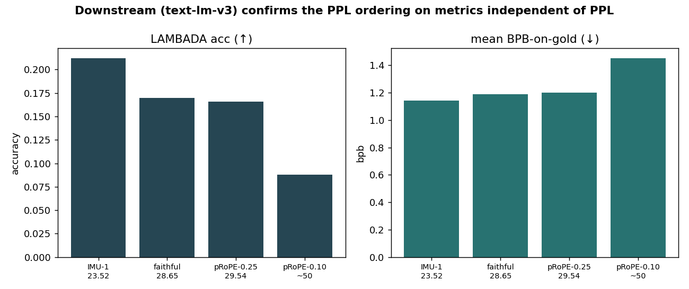
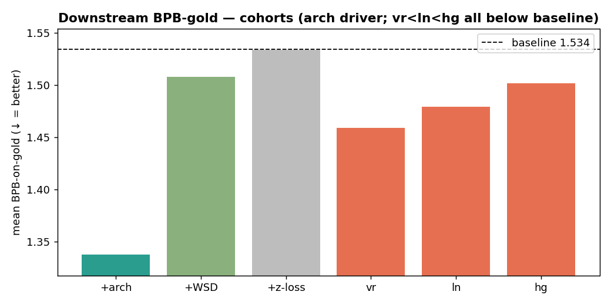
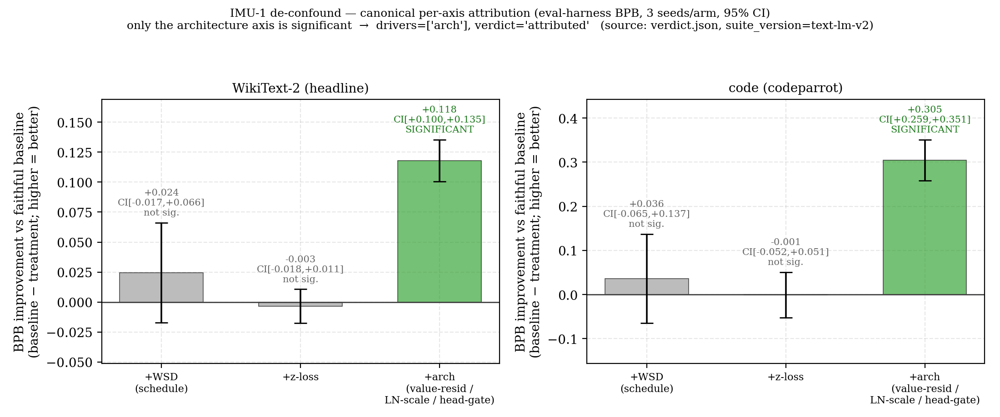
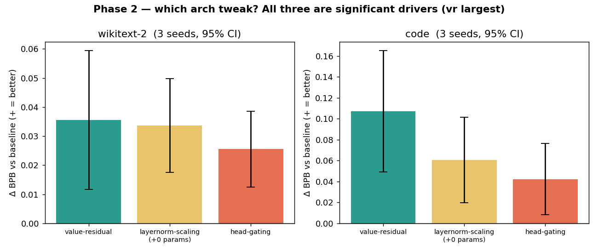
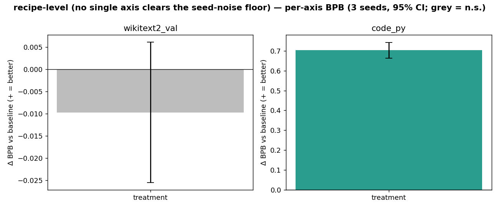
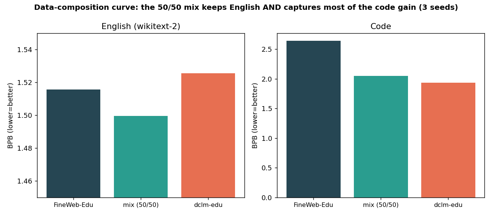

# Qwen3-0.6B — from-scratch reproduction + research experiment

A single-file PyTorch reproduction of [`Qwen/Qwen3-0.6B-Base`][hfbase] (596M-param
decoder-only transformer), **verified bit-exact in fp32 on CPU** against the official
HuggingFace weights (`max |Δlogits| = 0.0` on a single 5-token prompt; there is no GPU
parity check — see [Results](#results-so-far)), used as the base for a **three-build experiment**:
reproduce it faithfully, then apply recent (2026) research methods and measure — at
matched compute — whether they beat the faithful baseline.

> **Status: IMU-1 win de-confounded → all three arch modules attributed; data arm, mid-training and 3-seed SFT DONE; NorMuon's edge converges away with budget.**
> Architecture VERIFIED bit-exact (fp32/CPU); Phase A LR (`lr24 = 2.4e-3`); Phase B @ 2 TPP: faithful **28.65** ·
> **IMU-1 bundle 23.52 — a directional −17.9% delta** (n=1, single seed, same val cache as the faithful
> baseline) · partial-RoPE 0.25 **29.54 (loses)**.
> The IMU-1 win was a confounded bundle (NorMuon + WSD + z-loss + 3 arch tweaks). **Phase 1 de-confound is
> DONE** (run `2026-06-18_…imu1-deconfound-p1`, 12/12 cells, canonical eval-harness **BPB** verdict
> `overall_verdict: attributed`): on the canonical metric **+arch is the SOLE driver** (wikitext **−0.118 bpb**,
> 95% CI [0.100, 0.135]; code **−0.305 bpb**, CI [0.259, 0.351] — both significant), while **+WSD is NOT
> significant** (CI crosses 0 — the −6.9% *in-loop proxy* gain did **not** survive the canonical metric) and
> **+z-loss is null**. So the −17.9% bundle = **NorMuon (optimizer, isolated separately at 42M tokens —
> and it converges away with budget) + the IMU-1 architecture modules (the only significant axis at 131M/cell).**
> **Phase 2 DONE** (`2026-06-21_…arch-subdrill-p2`): the arch win splits into **all three flags as significant
> drivers** — value-residual (largest), layernorm-scaling (parameter-free), head-gating — `attributed`, and the
> text-lm-v3 downstream battery confirms it. **Data arm DONE** (`2026-06-24_…data-dclm-vs-fineweb`, 2026-06-26):
> the fixed-token **dclm-edu vs FineWeb-Edu** A/B came back **null on English** (CI crosses 0) but a
> **large significant code win: −0.70 bpb, 95% CI [0.664, 0.743], 3 seeds**; it is logged `directional`
> because it is a single 131M budget, not because the code effect is inside the noise floor.
> **Mid-training DONE** too
> (`2026-06-30_…midtrain-anneal`).
> — see [End-to-end lifecycle](#end-to-end-lifecycle--what-weve-done--whats-next).

> **This is an index.** Each build has its own detailed README — see
> [the three builds](#the-three-builds) for links. The architecture itself is the
> single, fully-commented [`model.py`](model.py) (every choice cited inline).

[hfbase]: https://huggingface.co/Qwen/Qwen3-0.6B-Base
[qwen3paper]: https://arxiv.org/abs/2505.09388

---

## Results so far

**The perplexities on this page are NOT all mutually comparable.** They use the same
eval code, but two *different* 300k-token FineWeb-Edu val tails — one per token budget.
Only same-cache rows may be compared:

| Numbers | Val cache | How it was built |
|---|---|---|
| **13.40** (released Base) · **46.89 / 46.31 / 49.28** (Phase-A LR sweep) | `tokcache_133072000_300000.pt` | hardcoded at [`eval_original_vs_repro.py:22`](builds/2026-06-08_reproduce-faithful_qwen3-0.6b/eval_original_vs_repro.py) |
| **28.65** (faithful) · **23.52** (IMU-1) · **29.54** (pRoPE-25) | `tokcache_1191478400_300000.pt` | streamed by the faithful Phase-B run; the other arms load it |

So **46.31 / 13.40 = 3.46× is like-for-like**, but **28.65 / 13.40 and 23.52 / 13.40 are
cross-cache** and must not be read as clean gaps to the released model — no same-cache
score for the released model on the Phase-B tail exists on disk. Both tails were cut by
the pre-decontamination splitter that `train_qwen3.py:130-136` itself calls "leak-suspect".
The fix landed in `86e79f3` (2026-06-16 21:57 UTC) — by which point all four Phase-B arms had
already loaded that pre-fix cache: three had finished, and the fourth (partial-RoPE 0.10) was
still running and never completed (it died at step 5450/18150).

**Bit-exact reproduction — fp32, on CPU** — `verify.json`: `max_abs_error = 0.0`,
`dtype float32`, argmax `" Paris"` (params **596,049,920** is *not* in `verify.json` — it comes
from `model.py`'s param-count check and the trainer load logs), measured on the single 5-token prompt
`"The capital of France is"` (`input_shape [1, 5]`). That is the entire scope of the claim:
there is **no GPU parity check** for Qwen3, no per-layer or long-context check, and no
determinism flags are set anywhere in the repo. Within that scope our `model.py` *is*
Qwen3-0.6B.

**Two tiers of evidence — read them differently.** The repo's *defensible* results are the
single-variable, **3-seed, iso-FLOP** ablations scored on the canonical **BPB** metric (bits-per-byte
on held-out wikitext + code) with **across-seed 95% CIs**. The cross-*build* comparison is
**directional only**: each build is **n=1** (one seed) on **FineWeb-Edu val PPL** (in-distribution),
no seed CI, no downstream evals — a scaling/sanity reading, not a defended claim.

**Defensible (3 seeds · iso-FLOP · BPB · across-seed 95% CI):**

| Result | Metric (vs faithful baseline) | Verdict |
|---|---|---|
| **NorMuon > AdamW** *at a 42M-token budget only* | wikitext −0.474 bpb [0.443, 0.505] · code −0.502 [0.456, 0.547] | **significant at 42M (this run's own ledger verdict is `win`) — but it [converges away with budget](#scaling-persistence-the-normuon-edge-converges-away): the ladder run `2026-07-05_…scaling-persistence` is ledger verdict `null`** |
| **arch modules drive the IMU-1 win** | wikitext −0.118 bpb [0.100, 0.135] · code −0.305 [0.259, 0.351] | **significant — sole driver** |
| WSD schedule · z-loss | CI crosses 0 (both corpora) | **not significant** |

**Directional (n=1 · FineWeb-Edu val PPL · single seed — NOT a defended claim):**

| Model | Training tokens | val PPL (n=1) | Val cache | Gap vs original |
|---|---|---|---|---|
| **Original** `Qwen3-0.6B-Base` (our eval) | 36T | **13.40** | `…133072000…` | 1.0× |
| Our best (Phase A, `lr24`) | 131M | 46.31 | `…133072000…` | **3.46×** (same-cache) |
| IMU-1 bundle (Build 2) | 1.19B | 23.52 | `…1191478400…` | *cross-cache — not comparable to 13.40* |
| Faithful baseline (Build 1) | 1.19B | 28.65 | `…1191478400…` | *cross-cache — not comparable to 13.40* |
| partial-RoPE 0.25 (Build 3) | 1.19B | 29.54 | `…1191478400…` | *cross-cache — not comparable to 13.40* |

The three 1.19B rows **are** mutually comparable (same cache): IMU-1 23.52 vs faithful
28.65 is a **−17.9% n=1 delta**, and partial-RoPE 29.54 loses to the baseline.


**What the evidence supports (and what it doesn't):**

1. **Reproduction (directional):** the faithful baseline reaches **28.65** at 1.19B tokens against
   the released model's **13.40**, with **~30,000× less data** (1.19B vs 36T tokens) — but those two
   numbers sit on different val caches, so the implied 2.14× is *cross-cache*. The earlier
   131M-token probe **is** same-cache: **46.31 vs 13.40 = 3.46×** with ~275,000× less data. Taking
   the two ratios together suggests each ~10× of data roughly halves the gap, but that trend mixes
   caches and is n=1 — indicative, not measured.
2. **The de-confounded win (defensible):** the IMU-1 bundle's improvement over our own faithful
   baseline is **attributable to NorMuon (optimizer) + the architecture modules** — both proven at
   3 seeds, iso-FLOP, on BPB with CIs excluding 0; **WSD and z-loss are NOT significant**. The
   bundle's *−17.9% PPL* number itself is **n=1 and directional** — the defended claim is the
   per-component BPB attribution, not the single-seed bundle delta. *Caveat:* "matched compute" =
   matched **tokens** (1.19B); IMU-1 also ran NorMuon at **−30.5% throughput** (5,172 vs 7,444 tok/s
   final), which is **+43.9% wall-clock** (63.9 h vs 44.4 h) — uncounted by the 6ND FLOP model,
   though the often-quoted 1.00043 is a **parameter-count** ratio, not a measured FLOP ratio. No `train_flops` artifact exists for any Phase-B run, so
   the §C18 ≤5% iso-FLOP gate was never actually evaluated for the three-build comparison.

> **Rigor status (`text-lm-v3` downstream battery — RUN 2026-06-24):** the §C25 downstream battery
> (LAMBADA + per-task **BPB-on-gold** + ARC-e/HellaSwag/WinoGrande) has now been executed on **all 25
> checkpoints** (4 builds + Phase-1 + Phase-2) — full table:
> [`research/eval/downstream_v3/RESULTS.md`](../research/eval/downstream_v3/RESULTS.md). As §C25.6
> predicted, MC accuracy does not discriminate between arms — but only **WinoGrande** is literally at
> chance (0.52 vs 0.50, `signal: false`); **ARC-easy** (acc_norm 0.45, CI [0.403, 0.490]) and
> **HellaSwag** (0.36, CI [0.321, 0.405]) sit well above their 0.25 chance floor with `signal: true`.
> **LAMBADA + BPB-on-gold are the discriminators** — and they **independently confirm every attribution**.

### Downstream confirmation — the builds (1.19B tok), independent of PPL

| Build | val PPL | LAMBADA acc ↑ | BPB-gold ↓ |
|---|---|---|---|
| **IMU-1 (modernized)** | **23.52** | **0.212** | **1.142** |
| faithful baseline | 28.65 | 0.170 | 1.188 |
| partial-RoPE 0.25 | 29.54 | 0.166 | 1.202 |
| partial-RoPE 0.10 (abandoned) | ~50 | 0.088 | 1.451 |

The downstream ordering **exactly matches the PPL ordering** (IMU-1 > faithful > pRoPE) on two
metrics independent of PPL. Cohorts confirm it too: Phase-1 **+arch** is the downstream driver
(LAMBADA 0.142 vs baseline 0.035), and Phase-2 **vr < ln < hg all below baseline** on BPB-gold —
matching the canonical BPB verdicts. *(One real bug was caught + fixed mid-run: partial-RoPE
checkpoints were initially loaded as full-RoPE — `partial_rotary_factor` not applied — producing
garbage; re-run with the fix gives the sensible numbers above.)*





**Scaling trend:** `65.5M → 131M → 1.19B → 36T  ≈  96 → 46 → 28.65 → 13.4`.

**Phase A LR sweep** (131M tokens, matched compute) → picked the LR:
`lr17` (1.7e-3) = 46.89 · **`lr24` (2.4e-3) = 46.31 ← best** · `lr30` (3.0e-3) = 49.28.


The earlier **Build-2 IMU-1 smoke** (39.83 @ 65.5M tokens vs faithful smoke 95.87) was a
directional hint — now confirmed by the full 2-TPP run above (**23.52 vs 28.65**).

> **IMU-1 vs baseline: DECIDED — IMU-1 wins (23.52 < 28.65).**
> **partial-RoPE vs baseline: DECIDED — partial RoPE LOSES.** 0.25 finished at
> **29.54 (3.1% worse than the 28.65 baseline)**; 0.10 **died incomplete** at step
> 5450/18150 (~30%; last eval 50.71 @ step 4000, far worse). Reducing the rotated RoPE fraction does
> **not** match the full-RoPE baseline at this scale — a clean, if negative, result.

---

## Plots & figures gallery

All figures are generated **CPU-only from the on-disk logs/CSVs** (every number traces to a
file; partial/in-progress runs are labelled). Full set + captions:
[`PLOTS_INDEX.md`](PLOTS_INDEX.md) (31 figures). Regenerate the cross-build panel with
[`builds/comparison/make_all_builds_comparison.py`](builds/comparison/make_all_builds_comparison.py).

### Cross-build comparison — matched compute, *same steps*

The three builds (plus the abandoned partial-RoPE-10%) on one axis: identical 1.19B-token
budget (18,150 steps x 65,536 tok), identical eval slice. IMU-1 sits below the baseline the
whole way; partial-RoPE stays above it.


### Phase A — learning-rate sweep (131M tokens)

`lr24 = 2.4e-3` won at matched compute (the LR Qwen3 never published for 0.6B).


### Per-build training dynamics

**Build 1 — Faithful baseline** — loss/LR, grad-norm, peak-mem vs the 109 GB cap, val PPL:


**Build 2 — Modernized (IMU-1 bundle)** — training CE and the eval-PPL descent to 23.52:


**Build 3 — Exploratory (partial-RoPE)** — prope25 complete (29.54); prope10 dashed (died @5450):


### Controlled attribution — NorMuon vs AdamW (single-variable, 3 seeds, iso-FLOP, verifier-PASS)

The clean optimizer isolation that de-confounds one strand of the IMU-1 bundle: NorMuon beats
AdamW by **+0.474 bpb on wikitext-2 (95% CI [0.443, 0.505])** and +0.502 on code — significant
**at this 42M-token budget**. It does not survive more budget — see
[the scaling ladder below](#scaling-persistence-the-normuon-edge-converges-away).


### Scaling persistence: the NorMuon edge converges away

**The +0.474 bpb win above is a 42M-token result and does not survive more budget.** A
budget ladder at fixed N=596M (`experiments/2026-07-05_qwen3-0.6b_scaling-persistence/`,
re-scored 2026-07-28, **n=3 seeds/arm at every rung**) sweeps only `--steps`:

| Budget | wikitext-2 gap (bpb) | 95% CI | code_py gap | 95% CI |
|---|---|---|---|---|
| 42M | **+0.474** | [0.443, 0.505] | **+0.502** | [0.456, 0.547] |
| 168M | **+0.126** | [0.089, 0.163] | **+0.176** | [0.137, 0.215] |
| 420M | **+0.072** | [0.055, 0.088] | **+0.177** | [0.131, 0.223] |

OLS over log10(tokens): wikitext slope **−0.417** (r² 0.923), code **−0.342** (r² 0.841).
`trend_verdict: CONVERGES` on both corpora; **`ledger_verdict: null`**.

**Read it as: an early-training speedup that converges away, not an advantage at scale.**
Three honest qualifications:

1. The gap at 420M is **still nominally significant** (CI excludes 0). "Falls within the
   noise floor" refers to the *OLS-fitted* edge at the top rung (0.0297) vs the noise
   floor (0.0368) — `edge_resolved: false` on wikitext, `true` on code.
2. **On code the label "converges" is generous**: 0.176 → 0.177 between the last two rungs
   is a *plateau*, not convergence, and the negative slope is carried by the 42M point.
   `verdict.json` itself hedges: *"still above noise at the largest measured budget but
   trending out — the edge is eroding, extend the ladder before claiming it."*
3. **Inherited confound:** both LRs were tuned at 42M and never re-tuned per horizon, so
   part of the fade may be a mis-tuned-LR artifact. Nothing on disk separates the two.

This is a **budget** null at fixed N=596M. Nothing here says anything about larger N.

### Deconfounding the IMU-1 win — 12-cell single-variable ladder (DONE — arch is the driver)

*Which* component of the IMU-1 bundle drives the -17.9%? A single-variable, 3-seed,
iso-FLOP ladder at a matched **131M-token / 2000-step proxy** (baseline vs +WSD vs +z-loss
vs +arch, all AdamW). **Complete (12/12 cells); canonical eval-harness BPB verdict**
(`verdict.json`, `overall_verdict: attributed`; bpb reduction, **+** = better, significant iff CI excludes 0):

| Axis vs baseline | wikitext-2 Δbpb (95% CI) | code Δbpb (95% CI) | verdict |
|---|---|---|---|
| **+arch** (value-residual + LN-scaling + head-gating) | **+0.118** [0.100, 0.135] | **+0.305** [0.259, 0.351] | **DRIVER** (both CIs exclude 0) |
| +WSD (schedule) | +0.025 [**−0.017**, 0.066] | +0.036 [**−0.065**, 0.137] | not significant |
| +z-loss | −0.003 [−0.018, 0.011] | −0.001 [−0.052, 0.051] | null |

**The proxy flipped on the canonical metric.** The *in-loop val-PPL* proxy had ranked +arch −22%
**and** +WSD −6.9% (significant) — but on the canonical BPB, **only arch survives**; +WSD's CI
straddles 0. **+arch is the sole attributed driver** (baseline bpb 1.516/2.639 → arch 1.398/2.334),
so the −17.9% bundle decomposes into **NorMuon (isolated separately at a 42M budget; it converges away at larger budgets) + the IMU-1
architecture modules** — not schedule, not z-loss. This is exactly why the loop trusts eval-harness
BPB, not in-loop PPL, as the verdict (the in-loop plots below are the proxy; the table above is the verdict).
The honest same-step caveat is built in: the deconfound arms are *complete* 2000-step runs
(LR fully decayed), while a build's "step 2000" is a *mid-run* snapshot of an 18,150-step run
(LR still high) — so the valid cross-check is deconfound-baseline (46.4) ≈ Phase-A faithful
complete-run (46.31), which holds.

**The canonical verdict figure** (the headline — eval-harness BPB, 3 seeds/arm, 95% CI; only the
arch axis is significant, so `drivers=[arch]`):



The three figures below are the **in-loop val-PPL proxy** (the trainer's quick eval during
training) — kept to show the proxy→canonical flip (the proxy ranked +WSD a driver; the
canonical BPB above does not), *not* the verdict:


### Post-training — SFT (VibeThinker reasoning, n=1 preliminary — SUPERSEDED)

In-loop reasoning PPL 14.26 -> 11.60 (n=1, response-only scoring — see the correction below);
no catastrophic forgetting (FineWeb-Edu retained).

> **This n=1 number is an in-loop metric with a known confound** (response-only vs all-token
> scoring) and has been superseded by the 3-seed run `2026-06-27_qwen3-0.6b_sft-3seed`
> (2026-06-30), which re-scored on a fixed held-out set: masked reasoning PPL
> **14.127 → 11.573 (−18.1%)** vs base, but response-masking does **not** separate from its
> iso-FLOP `--no_mask` control (+0.009 PPL masked *significant* / −0.006 full-sequence *not*
> significant) → `overall_verdict: directional — masked and full-sequence comparisons disagree on
> significance; treat as not-yet-separable`. No catastrophic
> forgetting (held-out FineWeb-Edu 21.495 base → 21.652 SFT / 21.660 control).


---

## End-to-end lifecycle — what we've done & what's next

This model is the spine of a full **small-scale LLM lifecycle** run on one GB10 box
(no rented compute). Every number traces to the ledger
(`research/ledger/ledger.json`) or a build log.

### Done (with sources)

| Stage | Result | Evidence |
|---|---|---|
| **Architecture** | bit-exact vs HF **in fp32 on CPU, 5-token prompt** (`max\|Δlogits\| = 0.0`), 596,049,920 params. No GPU parity check exists. | `verify.json` |
| **Pretrain — 3 builds @ 2 TPP** | faithful 28.65 · **IMU-1 23.52 (−17.9%)** · partial-RoPE 0.25 29.54 (loss); 0.10 died incomplete @ step 5450/18150 (~30%). All n=1, single-seed, in-distribution val PPL on a leak-suspect tail — **directional, not a defended claim** | build logs (above) |
| **Optimizer ablation (clean, single-variable)** | NorMuon beats AdamW at **42M tokens**: wikitext **−0.474 bpb** (95% CI [0.443, 0.505]), code −0.502 bpb ([0.456, 0.547]) — significant *at that budget*. **The scaling ladder nulls its persistence: wikitext gap 0.474 → 0.126 → 0.072 (`CONVERGES`); code plateaus 0.176 → 0.177 and stays significant. Ladder ledger verdict `null`.** | ledger `2026-06-16_qwen3_normuon-vs-adamw`, `2026-07-05_…scaling-persistence` |
| **De-confound attribution (Phase 1, single-variable, 3-seed, iso-FLOP)** | the IMU-1 win is **architecture**: **+arch −0.118/−0.305 bpb** (95% CI excludes 0, both corpora) is the **sole driver**; +WSD not significant on canonical BPB, +z-loss null → bundle = **NorMuon + arch modules** | ledger `2026-06-18_…imu1-deconfound-p1`, `verdict.json` |
| **Post-train — SFT (3 seeds + iso-FLOP `--no_mask` control, 2026-06-30)** | held-out masked reasoning PPL **14.127 → 11.573 (−18.1%)** vs base; response-masking does **not** separate from the control (+0.009 masked *sig* / −0.006 full-seq *n.s.*) → **`directional` — not a win**. No catastrophic forgetting (FineWeb-Edu 21.495 → 21.652). Supersedes the n=1 VibeThinker probe. | `2026-06-27_qwen3-0.6b_sft-3seed/reasoning_verdict.json` |
| **Paper** | consolidated single-model study **`qwen3-0.6b-study`** — status **drafting** (arXiv/HF source tree, PDF built via Tectonic, 14 API-verified refs); the earlier per-result *"Reproduce, Then Modernize…"* paper is **abandoned/superseded** by it | ledger `papers[]` (2 entries) |
| **Harness-search side-quest** | Meta-Harness replication: on the bin-packing target, gated search **beat** the hand-designed baseline by **+5.3 pts** (95% CI [+4.5, +6.2], held-out) — but selecting by raw search-score crowned a brittle overfit (0.0 on an unseen seed). The transferable contribution is the **promotion gate** (held-out + brittle-exclusion + significance), which recovers the real win and refuses the brittle one; oracle-integrity fixes (codeharness reward-hack + seqpack module-shadowing) committed (`bdc5ec6`, tests 309→317). | `research/harness_search/` |

### Phase 1 (DONE) — de-confound the IMU-1 bundle

`Qwen3-0.6B/experiments/2026-06-18_qwen3-0.6b_imu1-deconfound-p1/`. The IMU-1 win was a
confounded bundle; this was a **single-variable** ladder — each arm differs from the
faithful baseline by exactly one flag (`model_imu1` with arch-flags **off** is proven
bit-identical to the faithful model, so the baseline is genuinely faithful):

| Arm | schedule | z-loss | arch | (optimizer = AdamW 1.7e-3, all arms) |
|---|---|---|---|---|
| baseline | cosine | 0 | off | = faithful recipe |
| +WSD | **WSD** | 0 | off | |
| +z-loss | cosine | **1e-4** | off | |
| +arch | cosine | 0 | **on** | model_imu1's 3 tweaks |

3 seeds/arm (paired), **iso-token** (token-matched; +arch adds 0.077% params → **parameter-count**
ratio 1.00043, used as the proxy for the 5% gate — no measured FLOP count exists), 2000-step proxy (131M tok/cell, ~5h/cell,
**~2.5 days** total). Verdict by the across-seed 95% CI
(`eval_stats.seed_delta_significant`). NorMuon is already isolated (the win above), so
it is excluded here. _The proxy-budget caveat played out exactly as designed: small
per-component deltas could have sat inside the seed-noise floor — and WSD/z-loss did
(CIs cross 0, not significant), while arch's signal was large and cleanly significant.
So the budget was sufficient to attribute the win without needing a higher-budget re-run._

**How it runs / how we read it.** One parameterized trainer (`train_ablation.py`,
each arm = one CLI flag flipped) driven by a sequential supervisor (`run_arms.sh`) —
**one trainer at a time** (GB10 §C4.5), `sentinel.py`-guarded, **idempotent** (a crash
re-runs the supervisor, which skips finished cells and resumes the interrupted one from
its last 250-step checkpoint). When all 12 cells finish, `/eval-harness` scores every
checkpoint on the fixed suite (model's own tokenizer, `suite_version` pinned) and
`research/eval_stats.py::seed_delta_significant` computes the **across-seed 95% CI** for
each axis (arm − baseline). An axis is called a *driver* only if its CI excludes 0; a CI
that straddles 0 is reported `not significant`. Progress + verdict land in the ledger
run `2026-06-18_qwen3-0.6b_imu1-deconfound-p1`.

**Pre-launch validation (the "tests" for this build).** Before any GPU budget: CPU
dry-run of all **4 arms** (single-variable confirmed — baseline/wsd/zloss share an
identical forward, only +arch changes it); GPU **smoke 4/4 + a resume round-trip**
(checkpoint → reload → continue); **iso-token** check via `flop_accounting.py` (arch-on
adds 0.077% params → **parameter-count** ratio **1.00043**, used as the proxy for the 5% gate; no measured FLOP artifact was written). Results→verdict is
pre-wired: `score_cohort.py` (scores all 12 checkpoints — uses `model_imu1` with per-arm
arch flags so the +arch checkpoints load) → `verdict.py` (`seed_delta_significant`, 15
tests green) → auto-fired by the conditional `post_cohort.sh` watcher on `cohort.done`.

**FINAL (Jun 21 — 12/12 cells; canonical BPB verdict in `verdict.json`):** baseline ✓✓✓ ·
wsd ✓✓✓ · zloss ✓✓✓ · arch ✓✓✓. **`overall_verdict: attributed` — +arch is the sole driver**
(wikitext −0.118 bpb [0.100, 0.135], code −0.305 bpb [0.259, 0.351], both CIs exclude 0); **+WSD
NOT significant** on BPB (CI crosses 0); **+z-loss null**. The two-stage story is the point: the
*in-loop val-PPL* proxy had ranked **+arch −22% AND +WSD −6.9%** (baseline 46.44 · +z-loss 46.47
null · +WSD 43.24 · +arch 36.20) — but on the canonical metric **only arch survives**; WSD's proxy
gain evaporated. That gap (proxy says significant, BPB says not) is precisely why the loop trusts
eval-harness BPB, not in-loop PPL, as the verdict. So the −17.9% bundle = **NorMuon (optimizer,
proven) + the IMU-1 architecture modules** (value residuals + LayerNorm-scaling + per-head gating,
IMU-1 Eq.3/4/5) — not schedule, not z-loss.

**GB10 memory engineering (a real single-box lesson).** The full 151,936-vocab logits make
`torch.compile`'s startup transiently spike the **unified pool to ~80.7%**, tripping the
default 80% `sentinel.py` guard — it killed the zloss cell **4×** (the trainer's own RSS was
only 4.6 GB, so it was the *pool*, not the trainer; snap-confined Firefox couldn't be freed
to make room). Fix: raise the **per-cohort sentinel to `--kill-at 0.83`** (still under
`safe_cuda`'s 0.85 CUDA hard-cap, which errors cleanly — so the box stays crash-safe) and
run the full **mb4+compile** config, *identical* to baseline/wsd (zero execution confound)
at ~5,000–6,800 tok/s. Net throughput holds; revised total **~2 days**.

### Phase 2 (DONE) — *which* arch tweak carries the win?

`Qwen3-0.6B/experiments/2026-06-21_qwen3-0.6b_arch-subdrill-p2/`. Phase 1 attributed the win to the
arch bundle; Phase 2 split it into its **three already-separate flags** as single-variable sub-arms:
**value-residual** vs **layernorm-scaling** vs **head-gating** — baseline (reused from Phase 1, §C13
control-reuse) + 3 sub-arms × 3 seeds = **9 new cells**, iso-FLOP (vr +84 params, ln **+0**
parameter-free, hg +0.077%), 2000-step proxy. Same machinery, minimal diff: `train_ablation.py` →
`train_subdrill.py` (a 4-line flag split), `run_arms.sh` → `score_cohort.py` → `verdict.py` →
`post_cohort.sh` watcher, 0.83 sentinel guard. All §C5 gates passed before launch (smoke 3/3 +
resume round-trip + iso-FLOP).

**FINAL (Jun 23 — 9/9 cells; canonical BPB verdict in `verdict.json`):** vr ✓✓✓ · ln ✓✓✓ · hg ✓✓✓.
**`overall_verdict: attributed`, `drivers=[vr, ln, hg]` — all three arch flags are significant drivers**
(every CI excludes 0), with **value-residual the largest** contributor:

| Arch flag vs baseline | wikitext-2 Δbpb (95% CI) | code Δbpb (95% CI) | verdict |
|---|---|---|---|
| **vr** — value-residual (+84 params) | **+0.0355** [0.012, 0.059] | **+0.107** [0.049, 0.165] | **DRIVER (largest)** |
| **ln** — layernorm-scaling (**+0 params**) | +0.0337 [0.018, 0.050] | +0.061 [0.020, 0.101] | **DRIVER (parameter-free)** |
| **hg** — head-gating (+0.077%) | +0.0256 [0.013, 0.039] | +0.042 [0.008, 0.076] | **DRIVER (smallest, still real)** |



**The proxy mis-ranked again** — exactly the Phase-1 lesson, repeated. The completed *in-loop val-PPL*
proxy (the trainer's quick eval, **not** the verdict) had `ln` marginally ahead of `vr`:

| Arm (flag) | proxy seeds (val PPL @2000) | mean | Δ vs baseline 46.44 |
|---|---|---|---|
| ln — layernorm-scaling | 42.40 / 42.35 / 42.54 | 42.43 | −8.6% |
| vr — value-residual | 44.03 / 42.27 / 42.97 | 43.09 | −7.2% |
| hg — head-gating | 44.03 / 43.74 / 44.89 | 44.22 | −4.8% |

…but on the canonical BPB it's **vr > ln > hg**. Same in-loop metric that over-credited WSD in Phase 1;
same reason the loop trusts eval-harness BPB, not in-loop PPL, as the verdict. Per **§C25** this
single-mix / single-scale result is honestly **directional** (on this corpus, at this scale) — making a
winner "universal" needs a rented multi-scale / multi-data grid. The `text-lm-v3` downstream battery
(LAMBADA + BPB-on-gold, run on all 25 checkpoints) independently confirms the per-flag ordering.

### Data arm (DONE) — fixed-token data-selection A/B (lifecycle step 2; launched Jun 24)

`Qwen3-0.6B/experiments/2026-06-24_qwen3-0.6b_data-dclm-vs-fineweb/`. With the architecture attribution
settled, the next lever is **data** (the gap to the original's 13.40 is *data scale, not skill*). A
fixed-token data-selection A/B: **dclm-edu** (treatment) vs **FineWeb-Edu** (control, **reused** from the
Phase-1 baselines, §C13) at a matched 131M-token / 2000-step budget — same trainer family
(`train_dataarm.py`), same 0.83 sentinel guard, same `score_cohort.py → verdict.py → post_cohort.sh`
results→verdict wiring (OOD-BPB, strict 13-gram decontam, 0 leakage drops on the prepped slice).
Treatment cells only (control reused → ~3 new cells). *(Ultra-FineWeb-L3 was dropped — it's synthetic data.)*

**VERDICT (Jun 26, 3 seeds, OOD-BPB — a strong, verified, mixed result):**

| Corpus | FineWeb-Edu (control) | dclm-edu (treatment) | Δ (95% CI) | verdict |
|---|---|---|---|---|
| **English** (wikitext-2) | 1.516 bpb | 1.525 bpb | −0.010 [−0.026, +0.006] | **null** (CI crosses 0) |
| **Code** | 2.64 bpb (PPL **1890**) | 1.93 bpb (PPL **247**) | **+0.70 [+0.66, +0.74]** | **significant — large** |

At fixed tokens, dclm-edu is **equal on English but dramatically better on code** (a 7.6× PPL drop). Verified
it's **not** "more code" — dclm-edu has ~none (0.2 code-tokens/1k chars); rather **FineWeb-Edu's aggressive
educational-prose filter leaves the model catastrophically bad at code structure** (PPL 1890), while dclm-edu's
broader web distribution models it far better. **The bitter-lesson lever, confirmed:** a *data swap* moved code
BPB **−0.70** — bigger than NorMuon (−0.50) or the arch modules (−0.30). Data composition dominates method,
and reveals a real prose↔structure tradeoff. Per §C25: `directional` (single 131M budget, 2 corpora); robust across 3 seeds.



### Data-composition curve (DONE) — the 50/50 mix is best-of-both (Jun 27)

`Qwen3-0.6B/experiments/2026-06-26_qwen3-0.6b_data-mix-composition/`. The A/B above is a *two-point* result;
the mix arm makes it a **three-point composition curve** by adding a **50/50 FineWeb-Edu + dclm-edu** slice
(`train_dataarm.py --data mix`). Both prior arms **reused** (§C13: FineWeb-Edu = Phase-1 baselines, dclm-edu =
the A/B treatment), so only **3 new mix cells** trained.

**VERDICT (Jun 27, 3 seeds, OOD-BPB — bpb, lower=better):**

| Corpus | FineWeb-Edu | **mix (50/50)** | dclm-edu |
|---|---|---|---|
| **English** (wikitext-2) | 1.516 | **1.500** | 1.525 |
| **Code** | 2.639 | **2.048** | 1.935 |

**Best-of-both — no tradeoff.** The mix keeps English on par with FineWeb (Δ +0.016, CI [−0.001, +0.033] →
n.s., actually marginally the best of all three) **and** recovers **+0.59 of dclm-edu's +0.70 bpb code gain**
(~84%; significant, CI [+0.55, +0.63]). It's the only arm strong on *both* corpora — FineWeb is bad at code,
dclm is weaker on English, the mix gets nearly all the code benefit at zero English cost. → **the 50/50 mix is
the data carried into mid-training.**



_A data-loading bug was caught + fixed mid-stage: the first mix run shuffled tokens at the **token level**
(destroying sequence structure → "mix worse than both arms", physically impossible → a bug). The fix mixes at
the **sequence** level (`DataLoader(shuffle=True)` over coherent windows); the corrected mix sitting cleanly
**between** the two sources (2.05, between 2.64 and 1.94) confirms the fix. The `post_cohort.sh` watcher was also
hardened with a **4× retry** after a Jun-25 DNS blip briefly stranded the A/B verdict._

### The road to a finished lifecycle — steps ahead

The reachable target on this one GB10 box is a **rigorous small-scale** run of the *entire* LLM
lifecycle (full dated plan:
[`research/decisions/2026-06-21_lifecycle-completion-plan.md`](../research/decisions/2026-06-21_lifecycle-completion-plan.md)).
Honest estimate from measured throughput: **~3–5 weeks serial** (one GPU job at a time); the critical
path is **data → post-training**, and two stages are **rented-only** (the GB10 physically can't run them).
The scaffold is fixed; each technique is chosen by the prior stage's *measured* result — Phase 1's
proxy→canonical flip is exactly why we don't pre-commit the technique list.

| # | Stage (lifecycle ch.) | What | Status |
|---|---|---|---|
| 1 | **Phase 2 arch sub-drill** (Ch.3) | which of value-residual / LN-scaling / head-gating carries the win | **✅ DONE** — all 3 significant drivers (vr largest, ln parameter-free), `attributed`; downstream confirms |
| 2 | **Data arm** (Ch.2) | fixed-token data-selection A/B — **dclm-edu vs FineWeb-Edu** (control reused), OOD-BPB, strict decontam (the *bitter-lesson* lever: the gap to 13.40 is data-not-skill) | **✅ DONE** — null on English, **large significant code win** (−0.70 bpb, PPL 1890→247); data composition beats method. `directional` (single budget). |
| 2b | **Data-composition curve** (Ch.2) | add a **50/50 mix** arm (reuse both A/B arms, §C13) → does the code gain survive mixing without an English tradeoff? | **✅ DONE** — best-of-both: mix keeps English (on par) AND captures ~84% of the code win. The mix is the data for mid-training. |
| 3 | **Mid-training** (Ch.7) | anneal a base checkpoint on the **50/50 mix** @ low LR + RoPE context-extension | **✅ DONE** (`2026-06-30_…midtrain-anneal`, `final_verdict: win`) |
| 4 | **Serving export** (Ch.14) | vLLM registration shim — *pulled forward*, it unblocks GRPO rollouts | planned |
| 5 | **Post-training** (Ch.9–11) | SFT **≥3-seed** + paired control → DPO → GRPO/RLVR | **SFT ✅ DONE** (`2026-06-27_…sft-3seed`, 2026-06-30 — `directional`, masking does not beat its control); DPO / GRPO still planned |
| 6 | **Serving bench** (Ch.14) | `/serving-bench` continuous-batching + paged-KV + `--quant fp8`; `/observability-slo` SLOs | planned |
| 7 | **Safety** (Ch.12) | `/safeguards-eval` + red-team passes (methodology demo; 0.6B isn't ASL-relevant) | planned |
| 8 | **Interpretability** (Ch.13) | SAE / probing demo, control-floor-first | **on-box core BUILT** (`research/interp.py`: BatchTopK SAE + PCA/random floors + the CI-disjoint anti-laundering gate; `roc_auc`/`bootstrap_ci`/`mcnemar` verified vs sklearn/scipy; 342 tests). Honest verdict baked in: a **CI-backed null at the floor is the *passing* result** at 596M/1.19B (arXiv:2602.14111). Skill wrapper + GPU run pending |
| 9 | **Publish** (Ch.15) | `/manuscript` — clean attributed headline (NorMuon + the 3 arch modules), behind human submit | headline ready; gated on a §C25-complete result + human submit |
| R | **Kernel roofline** (Ch.5/14) · **Distributed scaling** (Ch.5) | one Triton kernel + roofline; FSDP/TP scaling table | **rented-only** (human-$ gate) |

_Side bets (propose-only, off the critical path):_ a Zeta-vs-NorMuon optimizer replication at the
paper's regime (**rented** — [`research/proposals/zeta-tuned-baseline-replication.md`](../research/proposals/zeta-tuned-baseline-replication.md));
shipping the nightly `/research-loop` end-to-end (one autonomous idea→paper pass = the Tier-0 milestone).

> **GB10-only reality:** the reachable target is the **rigorous small-scale** lifecycle above —
> *not* at-scale distributed training (multi-node / MFU-at-scale need rented compute this box
> doesn't have). "A+-evidence, not A+-credential."

---

## The three builds

Each is a self-contained folder with its own README, model/scripts, verify gate,
and results. Click through for the detail.

| Build | Folder (→ README) | What changes | Backing paper | Status |
|---|---|---|---|---|
| **1 · Faithful** | [`builds/…reproduce-faithful…`](builds/2026-06-08_reproduce-faithful_qwen3-0.6b/README.md) | nothing — exact arch, AdamW + cosine (the baseline + shared harness) | [Qwen3 TR][qwen3paper] | ✅ baseline = **28.65** |
| **2 · Modernized** | [`builds/…reproduce-modernized…`](builds/2026-06-08_reproduce-modernized_qwen3-0.6b/README.md) | full **IMU-1 bundle**: NorMuon + value residuals + LayerNorm-scaling + per-head gating + cautious-WD + WSD + z-loss | [IMU-1](https://arxiv.org/abs/2602.02522), [NorMuon](https://arxiv.org/abs/2510.05491) | ✅ **23.52 — beats baseline −18%** |
| **3 · Exploratory** | [`builds/…reproduce-exploratory…`](builds/2026-06-08_reproduce-exploratory_qwen3-0.6b/README.md) | **partial RoPE** — rotate 25% / 10% of head dims, pass the rest through | [arXiv:2603.11611](https://arxiv.org/abs/2603.11611) | ✅ 0.25 = **29.54** (loses to baseline); 0.10 **died incomplete** @ step 5450/18150 (~30%; last eval 50.71) |
| — · Survey | [`builds/…target-survey…`](builds/2026-06-08_target-survey/README.md) | why Qwen3-0.6B was chosen (model-selection phase, not a build) | — | ✅ done |

Each build's verify gate proves the *unchanged* components stay bit-identical to the
faithful model, so any result is attributable to the one thing that changed.

---

## Architecture at a glance

Full spec is in [`model.py`](model.py) (one file; every value annotated to its upstream
`config.json` field, pulled live via `AutoConfig` — there is no local `config.json`).

| Field | Value | | Field | Value |
|---|---|---|---|---|
| Layers | 28 | | RoPE θ | **1e6** (not 1e4) |
| Hidden | 1024 | | RMSNorm eps | 1e-6 |
| Heads (Q/KV) | **16 / 8** (GQA 2:1) | | Vocab | 151,936 |
| head_dim | **128** (independent field) | | Tied embeddings | yes |
| FFN (SwiGLU) | 3072 | | Params | **596,049,920** |

The three things that differ from Llama/SmolLM2: **per-head QK-Norm** (RMSNorm on Q,K
*before* RoPE), `head_dim` is an **independent** config field (not hidden/n_heads), and
**RoPE θ = 1e6**. See the faithful build README and `model.py` comments for the rest.

---

## Repo layout

```
Qwen3-0.6B/
├── model.py                 # the architecture, one file — bit-exact vs HF (fp32/CPU)
├── verify.py                # parity gate
├── README.md                # this index
└── builds/
    ├── 2026-06-08_target-survey/                  # model-choice survey      (README)
    ├── 2026-06-08_reproduce-faithful_…/           # Build 1 + shared harness (README)
    ├── 2026-06-08_reproduce-modernized_…/         # Build 2: IMU-1 bundle    (README)
    ├── 2026-06-08_reproduce-exploratory_…/        # Build 3: partial RoPE    (README)
    └── phase_b_driver.sh                           # runs the 4 matched-compute runs
```

Checkpoints (`*.pt`, ~3.5 GB each) and token caches are **gitignored** — regenerate
them with the training scripts.

---

## Setup

```bash
pip install torch transformers datasets safetensors accelerate
python verify.py        # parity gate — runs on CPU, no GPU needed
```

Training needs a CUDA GPU. On the GB10 unified-memory box, only **one training job at
a time** (CPU+GPU share one ~119 GB pool — two concurrent runs overcommit and crash
the machine); the scripts import [`safe_cuda`](../safe_cuda.py) to cap the process.

---

## Honest accounting (short)

- ✅ **Architecture** — verified bit-exact vs HF in fp32 on CPU (`max|Δlogits| = 0.0`, 5-token prompt; no GPU parity check).
- 🔶 **Reproduction gap looks like data, not skill** — 3.46× at 131M tokens (same-cache)
  and ~2.1× at 1.19B (cross-cache, indicative). The trend mixes two val tails and every
  point is n=1, so it is suggestive, not a clean scaling curve.
- ✅ **Phase A LR (2.4e-3)** — an original verified finding (Qwen3 never published the
  0.6B LR).
- 🔶 **Phase B** — baseline (28.65), IMU-1 (**23.52, a directional −17.9% delta — n=1,
  single seed, no CI**), and
  partial-RoPE 0.25 (**29.54 — loses to baseline**) done; 0.10 **died incomplete** at
  step 5450/18150 (~30%; last eval 50.71). The partial-RoPE *vs* baseline comparison is **decided (it loses)**.
- ✅ **IMU-1 attribution** — de-confounded across two phases (3-seed iso-FLOP, canonical BPB):
  Phase 1 (12/12 cells) → **architecture modules are the sole significant driver** (+arch
  +0.118/+0.305 bpb, CIs exclude 0; WSD & z-loss not significant); Phase 2 (9/9 cells) →
  **all three arch flags are significant drivers, value-residual the largest** (vr +0.0355 >
  ln +0.0337 > hg +0.0256 bpb wikitext, every CI excludes 0).
- ✅ **Data composition > method (bitter lesson, measured)** — at fixed 131M tokens, dclm-edu vs
  FineWeb-Edu is **null on English but −0.70 bpb on code** (PPL 1890→247, 3-seed CI excludes 0);
  verified it's *not* code content (dclm-edu has ~none) but FineWeb-Edu's prose filter being bad at
  code structure. A *data swap* moved the metric more than NorMuon (−0.50) or arch (−0.30). The mix
  arm (now running) tests whether a blend keeps both.
- 🔶 **Interpretability core built, run pending** — `interp.py` (SAE + control floors + the CI-disjoint
  anti-laundering gate) is built + CPU-verified; the honest expectation at this scale is a **null at the
  control floor**, which the gate reports as a *pass*, never spun as "we found features".
- ⚠️ **2 TPP is ~80× below** the methods' validated regime → Phase B results will be
  **directional, not headline**; the IMU-1 bundle intentionally **confounds** ~6 changes.
- ⚠️ **Honest gaps** — muP omitted; NorMuon NS5 coeffs are the standard Muon values
  (not printed in the paper). See the modernized build README.

---

## Source map

| Topic | Source |
|---|---|
| Qwen3 architecture / recipe | [arXiv:2505.09388][qwen3paper] · live `config.json` |
| NorMuon optimizer | [arXiv:2510.05491](https://arxiv.org/abs/2510.05491) |
| IMU-1 bundle | [arXiv:2602.02522](https://arxiv.org/abs/2602.02522) |
| Partial RoPE | [arXiv:2603.11611](https://arxiv.org/abs/2603.11611) |
| RoPE · GQA · SwiGLU · RMSNorm | [2104.09864](https://arxiv.org/abs/2104.09864) · [2305.13245](https://arxiv.org/abs/2305.13245) · [2002.05202](https://arxiv.org/abs/2002.05202) · [1910.07467](https://arxiv.org/abs/1910.07467) |
