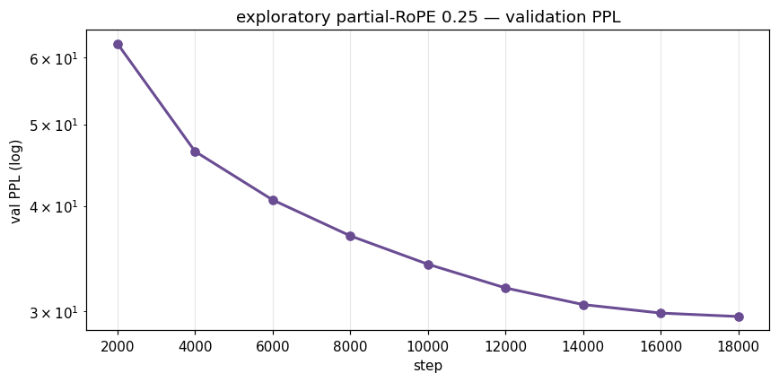
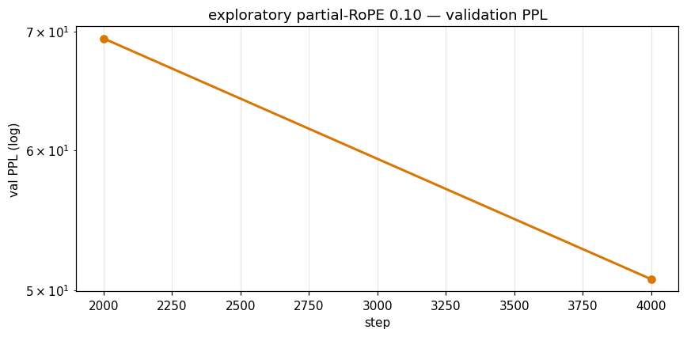

# Build 3 — Exploratory: partial RoPE

> **One line:** This build is the *faithful* Qwen3-0.6B from-scratch model with a
> single toggle added — **partial RoPE**: rotate only `partial_rotary_factor ×
> head_dim` of each head's dimensions and pass the rest through un-rotated. At
> `factor = 1.0` it collapses **bit-identically** back to the faithful baseline, so
> any measured training difference is attributable to the RoPE fraction and not a
> wiring change.

This is a **folder-scoped** README. For the shared Qwen3-0.6B architecture
(QK-Norm, GQA 16/8, SwiGLU, the spec sheet, parameter accounting, the three-build
experiment design, and the matched-compute methodology) see the parent README at
[`../../README.md`](../../README.md). Everything below is specific to *this* build.

---

## What this is (the experiment)

The faithful build applies RoPE to **all** of `head_dim = 128` dimensions of every
query/key head. This build makes the rotated fraction a config knob and runs it at
three settings:

| `partial_rotary_factor` | `rotary_dim` (rotated dims) | passed-through dims | role |
|---|---|---|---|
| `1.0`  | 128 | 0  | == faithful baseline (verify anchor) |
| `0.25` | 32  | 96 | Phase B run 3 (`prope25_2tpp`) — ✅ **DONE: val PPL 29.54** (loses to the 28.65 baseline by 3.1%) |
| `0.10` | 12  | 116 | Phase B run 4 (`prope10_2tpp`) — ⚠️ **died incomplete** at step 5450/18150 (~30%; last eval @4000 = 50.71) |

`rotary_dim = int(head_dim × factor)`, then rounded **down to even** (rotate_half
chunks in two), with `assert 2 ≤ rotary_dim ≤ head_dim`
(`model_partialrope.py:246-248`).

### The mechanism

The change lives in two places in `model_partialrope.py`:

1. **The cache** (`_build_rope_cache`, lines 93-98) is built over `rotary_dim`, not
   `head_dim`. `inv_freq` divides by `rotary_dim`:

   ```python
   inv_freq = 1.0 / (theta ** (torch.arange(0, rotary_dim, 2, ...) / rotary_dim))
   ```

   This follows the standard HF `partial_rotary_factor` convention used by
   GPT-NeoX / Phi / StableLM: the frequency band spans the same range over fewer
   dims (it divides by `rotary_dim`, **not** `head_dim`). When
   `rotary_dim == head_dim` the cache is bit-identical to the full-RoPE cache.

2. **The application** (`_apply_rope`, lines 106-119) slices each head into a
   rotated part and a pass-through part:

   ```python
   rd = cos.shape[-1]                      # == rotary_dim
   q_rot, q_pass = q[..., :rd], q[..., rd:]
   k_rot, k_pass = k[..., :rd], k[..., rd:]
   q_rot = (q_rot * cos) + (_rotate_half(q_rot) * sin)
   k_rot = (k_rot * cos) + (_rotate_half(k_rot) * sin)
   q_out = torch.cat([q_rot, q_pass], dim=-1)
   k_out = torch.cat([k_rot, k_pass], dim=-1)
   ```

   When `rotary_dim == head_dim`, `q_pass`/`k_pass` are empty and this is the
   full-RoPE path bit-for-bit. Everything else — QK-Norm, GQA, SwiGLU, RMSNorm,
   tied embeddings, the `1e6` theta — is unchanged from the faithful model.

### Backing paper

> "Fractional Rotation, Full Potential?" — **arXiv:2603.11611** (Mar 2026).

Per the project survey, the paper's claim is that **~10% rotation reaches
convergence comparable to full RoPE at the ~135M scale**
(`model_partialrope.py:52-56`). This build is the controlled test of that claim at
the Qwen3-0.6B (596M) scale, against the faithful full-RoPE baseline at matched
compute.

---

## Files in this folder

| File | What it does |
|---|---|
| `model_partialrope.py` | The faithful Qwen3ForCausalLM with one added config field, `partial_rotary_factor` (in `Qwen3Config`), and a sliced `_apply_rope` + `rotary_dim`-sized RoPE cache. Submodule/param names mirror HF `transformers.models.qwen3` so the official safetensors load with no key remap. |
| `verify_partialrope.py` | The verify gate. Proves `factor=1.0` is bit-identical to `../../model.py` (the faithful reference) and that `0.25`/`0.10` give the right `rotary_dim`, stay finite, and actually change the output. CPU / fp32 — does not touch the GPU sweep. |
| `train_partialrope.py` | The trainer. Same AdamW + cosine recipe as the faithful baseline (peak LR `2.4e-3`, the Phase-A winner); the only difference vs baseline is `--partial_rotary_factor`. Reuses the faithful trainer's data/eval/scheduler helpers. |
| `results/` | Both runs' logs, checkpoints, and per-run PPL-curve plots: `qwen3_prope25_2tpp_train.log` (run 3, DONE → 29.54) + `qwen3_prope25_2tpp_after.txt`, `qwen3_prope10_2tpp_train.log` (run 4, died incomplete at step 5450/18150 ~30%), and `plots/`. |
| `__pycache__/` | Compiled bytecode; ignore. |

> There is **no separate `Qwen3Config` reimplementation** here — `model_partialrope.py`
> is a self-contained copy of the faithful model with the one toggle added. The
> canonical config values (`vocab_size 151_936`, `hidden_size 1024`,
> `num_hidden_layers 28`, `head_dim 128`, `rope_theta 1e6`, `rms_norm_eps 1e-6`,
> etc.) are documented inline against `config.json`; see the parent README for the
> full spec sheet.

---

## How to run

### Verify (the bit-identity gate) — run this first

```bash
cd builds/2026-06-08_reproduce-exploratory_qwen3-0.6b
python verify_partialrope.py        # CPU / fp32; no GPU needed
```

It loads the faithful reference (`../../model.py`), copies its weights into the
partial-RoPE model at each factor (so only the RoPE buffer differs), and checks
logit equality/difference.

### Train (Phase B runs — one factor per invocation)

`--partial_rotary_factor` and `--run_name` are required. The matched-compute Phase
B recipe (from `../phase_b_driver.sh`, runs 3 and 4):

```bash
# Run 3 — partial RoPE 25%
python train_partialrope.py --steps 18150 --partial_rotary_factor 0.25 \
  --warmup_steps 900 --eval_every 2000 --ckpt_every 2000 --log_every 50 \
  --run_name prope25_2tpp

# Run 4 — partial RoPE 10%
python train_partialrope.py --steps 18150 --partial_rotary_factor 0.10 \
  --warmup_steps 900 --eval_every 2000 --ckpt_every 2000 --log_every 50 \
  --run_name prope10_2tpp
```

Defaults that define the matched-compute budget (`train_partialrope.py:36-52`):
`--seq_len 4096`, `--micro_batch 4`, `--grad_accum 4` ⇒ **65,536 tok/step**;
`--steps 18150` ⇒ **~1.19B tokens** (`18150 × 65,536 = 1,189,478,400`), the same
"2 TPP" budget as the faithful baseline. Peak LR `2.4e-3`, end LR `3.2e-4`, warmup
`900`, weight decay `0.01`, grad clip `1.0`, `--mem_fraction 0.85`, bf16.

These are **not** launched standalone in practice — they are runs [3/4] and [4/4]
of `../phase_b_driver.sh`, which runs all four Phase B jobs sequentially on one GB10.

---

## Results so far

### Verify gate — VERIFIED ✅

Captured from a live CPU run of `verify_partialrope.py` in this folder:

```
[1] factor=1.0  rotary_dim=128  max_abs_err vs faithful = 0.0
[2] factor=0.25  rotary_dim= 32 (want 32)  finite=True  max|Δ| vs full-RoPE = 0.8728  -> OK
[2] factor=0.1   rotary_dim= 12 (want 12)  finite=True  max|Δ| vs full-RoPE = 0.8307  -> OK

ALL PASS
```

| Check | Result |
|---|---|
| `factor=1.0` vs faithful `../../model.py`, max abs logit error | **0.0** (bit-identical) |
| `factor=0.25` rotary_dim | **32** (= 128 × 0.25) |
| `factor=0.10` rotary_dim | **12** (= int(128 × 0.10) → 12, already even) |
| `factor=0.25` max\|Δ\| vs full-RoPE (same weights) | **0.8728** (finite, non-zero → RoPE is doing something) |
| `factor=0.10` max\|Δ\| vs full-RoPE (same weights) | **0.8307** (finite, non-zero) |
| Overall | **ALL PASS** |

The `0.25`/`0.10` deltas are measured with **identical weights** to the baseline
(the faithful state dict is loaded into both via `load_state_dict(..., strict=True)`),
so the only thing that changed is the RoPE buffer — this isolates the partial-RoPE
effect from any weight difference.

### Training (Phase B partial-RoPE runs)

Phase B (`../phase_b_driver.sh`) runs four matched-compute jobs **sequentially** on
one GB10: [1] faithful baseline → [2] IMU-1 bundle → [3] partial RoPE 25% → [4]
partial RoPE 10%. Final status:

- **[1/4] faithful baseline — DONE**, `val PPL 28.65` (the full-RoPE reference).
- **[2/4] IMU-1 bundle — DONE**, `val PPL 23.52`.
- **[3/4] `prope25_2tpp` — ✅ DONE**, `val PPL 29.54` (final) — **loses to the baseline by 3.1%**.
- **[4/4] `prope10_2tpp` — ⚠️ DIED INCOMPLETE** at step 5450/18150 (~30%; last eval @4000 = `50.71`); the run never resumed, so 0.10 has no final number — but it was already tracking far behind both the baseline and 0.25.


#### prope25 (factor 0.25) — FINAL: 29.54, loses to baseline ❌

Same recipe as the baseline (AdamW, cosine, LR 2.4e-3) → the **only** variable is the
rotated-dim fraction, so this is the cleanest single-variable ablation in the project.
Full matched-step val PPL (`results/qwen3_prope25_2tpp_train.log`) vs the full-RoPE baseline:

| eval step | Baseline (full RoPE) | Partial-RoPE 25% | Δ |
|---|---|---|---|
| @2000 | 60.10 | 62.33 | +3.7% |
| @4000 | 45.06 | 46.42 | +3.0% |
| @6000 | 39.44 | 40.66 | +3.1% |
| @8000 | 35.71 | 36.86 | +3.2% |
| @10000 | 33.04 | 34.11 | +3.2% |
| @12000 | 30.93 | 31.97 | +3.4% |
| @14000 | 29.59 | 30.55 | +3.2% |
| @16000 | 28.93 | 29.85 | +3.2% |
| @18000 | 28.66 | 29.57 | +3.2% |
| **final** | **28.65** | **29.54** | **+3.1%** |



> **Verdict (single-seed, one budget): partial-RoPE 0.25 LOSES.** It tracks a
> **steady ~3% behind** full RoPE the whole way and finishes at **29.54 vs 28.65** —
> rotating only 25% of head dims costs a small but consistent amount and does **not**
> match the full-RoPE baseline at the 596M / 2-TPP scale. This contradicts a naive read
> of the paper's "comparable convergence at ~10%" claim *at this scale/budget* (the
> paper's regime is ~135M; the 10% setting died incomplete at ~30%, but was tracking
> far worse). Honest caveat: single
> seed, one budget, ~10× below Chinchilla — a directional **negative** result, not a
> publishable one.

#### prope10 (factor 0.10) — DIED INCOMPLETE (~30%, step 5450/18150)

Tracked **far worse** than both the baseline and 0.25 before the run died and was
never resumed (last eval `results/qwen3_prope10_2tpp_train.log`):

| eval step | Baseline (full RoPE) | Partial-RoPE 10% | Δ |
|---|---|---|---|
| @2000 | 60.10 | 69.37 | +15.4% |
| @4000 | 45.06 | 50.71 | +12.5% |

The run died incomplete at step 5450/18150 (~30%) with no decay tail, so 0.10 has no
final number — but at its last eval it was **~12.5% behind the baseline and worse than
0.25**, clearly not on course to match full RoPE at this scale.



---

## Gotchas

- **Imports reach outside this folder.** `train_partialrope.py` inserts the repo
  root, the model dir (`Qwen3-0.6B/`), this folder, **and the faithful build dir**
  onto `sys.path`, then imports `safe_cuda` (from `BuildFromScratch/`) and the
  faithful trainer helpers `stream_tokens, evaluate, PackedTextDataset,
  chunked_cross_entropy, make_cosine_scheduler` from `train_qwen3`
  (`train_partialrope.py:12-23`). `verify_partialrope.py` imports `model` from
  `../../model.py` as the faithful reference. Run the scripts from this folder so
  those relative paths resolve.
- **`rotary_dim` is rounded down to even**, so a factor that lands on an odd dim
  count loses one dim (e.g. an odd target would round down). `0.25→32` and
  `0.10→12` are both already even, so no rounding loss at the swept settings.
- **`factor=1.0` is the anchor, not a separate experiment** — it is identical to
  Build 1 (faithful) and exists only to prove the wiring. The real ablation is
  `0.25` and `0.10` vs the full-RoPE baseline.
- **CUDA is required for training** (`train_partialrope.py:57-59`); verify runs
  CPU-only by design so it doesn't contend with the GPU sweep.

---

## Provenance

- Architecture / shared details: [`../../README.md`](../../README.md)
- Faithful reference model (verify target): [`../../model.py`](../../model.py)
- Phase B driver (sequential run order): [`../phase_b_driver.sh`](../phase_b_driver.sh)
- Backing paper: "Fractional Rotation, Full Potential?" — arXiv:2603.11611 (Mar 2026)
- Target model: [`Qwen/Qwen3-0.6B-Base`](https://huggingface.co/Qwen/Qwen3-0.6B-Base)
