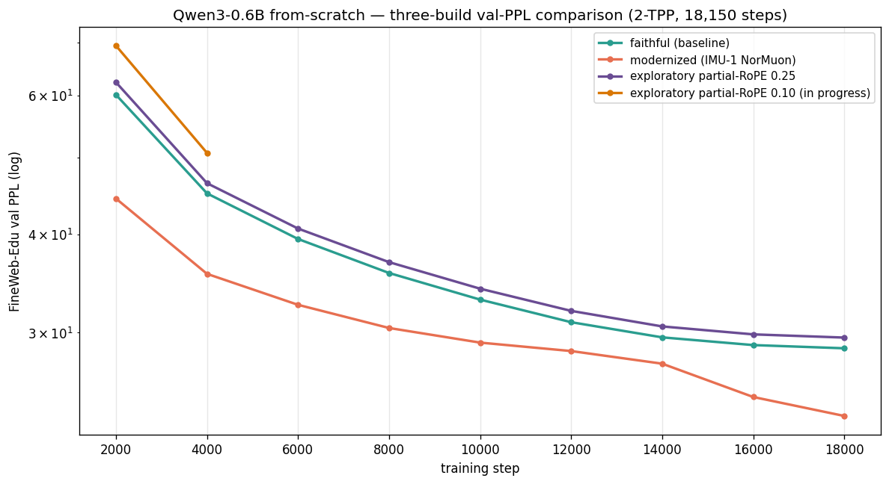
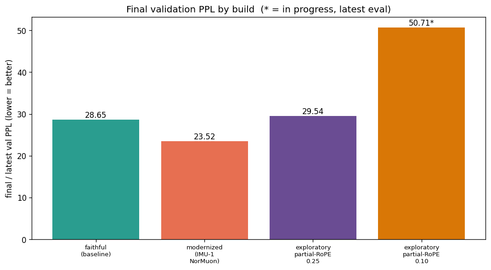

# Qwen3-0.6B — three-build results comparison

All runs: from-scratch, 18,150 steps, ~1.19B tokens (2 tokens/param), seq_len 4096, FineWeb-Edu, identical held-out val set → PPL directly comparable.

| build | final / latest val PPL | notes |
|---|---|---|
| faithful (baseline) | 28.65 | final |
| modernized (IMU-1 NorMuon) | 23.52 | final |
| exploratory partial-RoPE 0.25 | 29.54 | final |
| exploratory partial-RoPE 0.10 | 50.71 | died incomplete at step 5450/18150 (~30%); last eval — no final |

**Ranking (lower = better):** modernized (NorMuon bundle) < faithful < partial-RoPE 0.25 < partial-RoPE 0.10.

Partial RoPE (both 0.25 and 0.10) does **not** beat the faithful baseline at this scale; the NorMuon-bundle modernized build is the clear winner. The `text-lm-v3` cross-run eval-harness battery (LAMBADA + per-task BPB-on-gold) has since been run on all checkpoints and **confirms this ordering** independently of PPL — see [`research/eval/downstream_v3/RESULTS.md`](../../../research/eval/downstream_v3/RESULTS.md).

