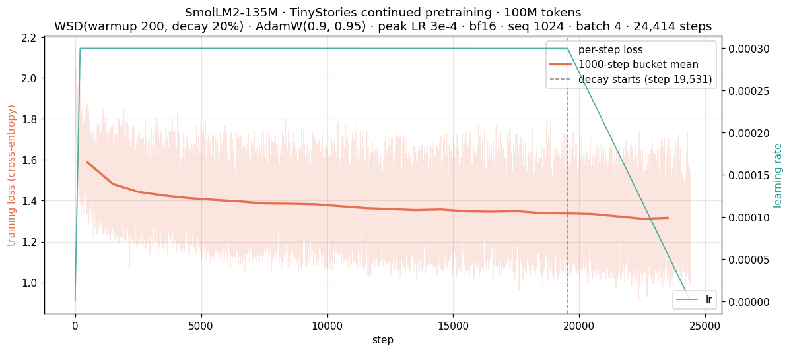
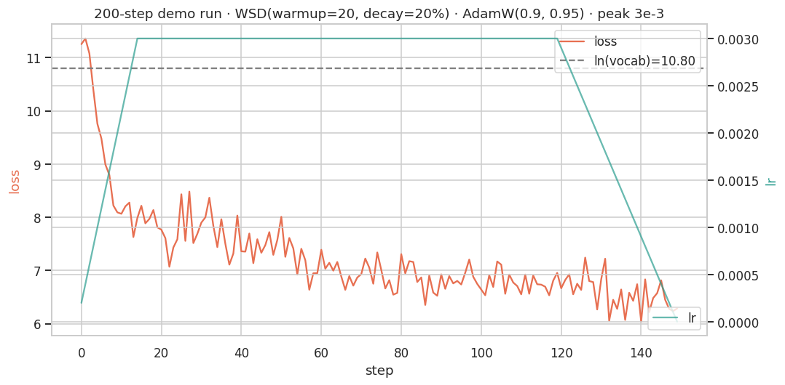
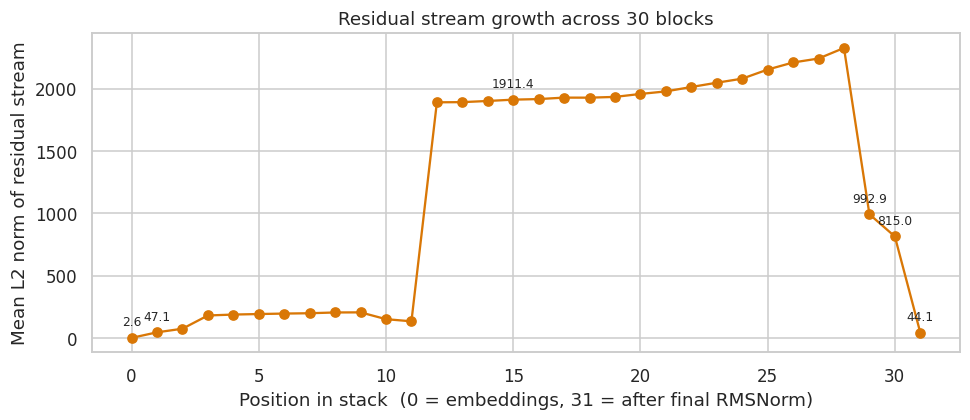
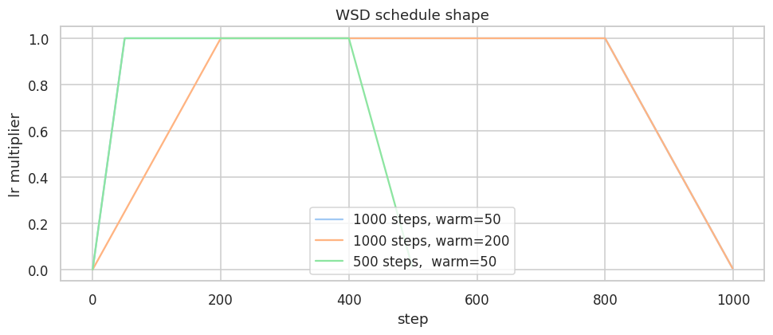
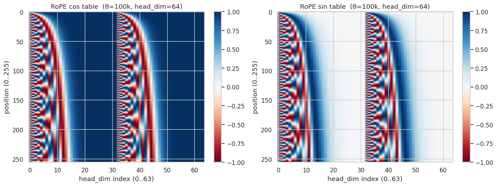
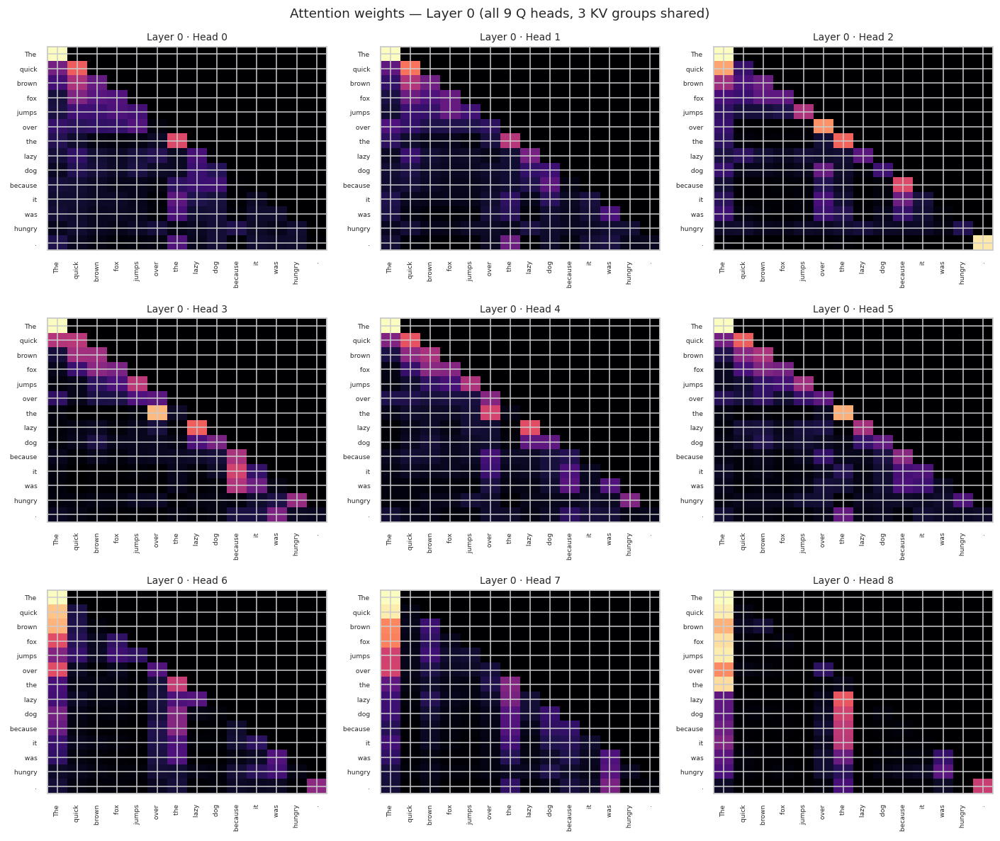
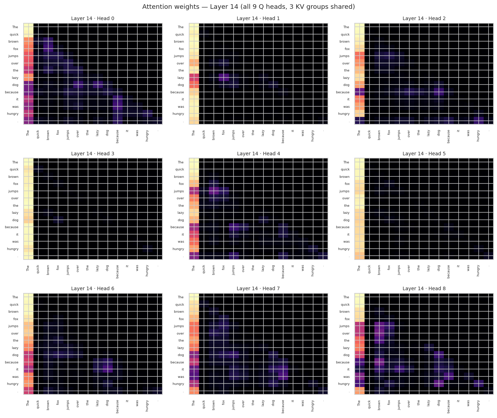
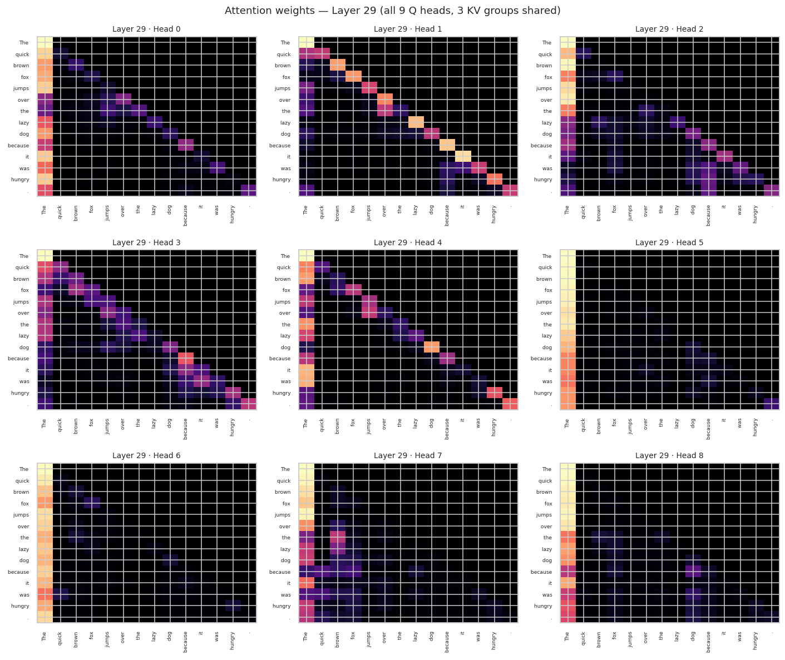

# SmolLM2-135M from scratch — what we built, how we built it, why every choice

A from-scratch PyTorch reproduction of [SmolLM2-135M][hfmodel], faithful to the
shipped `config.json` and the [SmolLM2 paper][paper]. The reproduction is
verified **bit-exact in fp32 on CPU** against HuggingFace's reference
`LlamaForCausalLM` (`max |Δlogits| = 0.0`). On **GPU** it is close but *not*
bit-exact — final-logits max 4.72e-05, per-layer hidden-state max 1.95e-03 at
layer 14 (which exceeds the repo's own 1e-3 gate); see
[`results/comparison_with_hf.md`](results/comparison_with_hf.md) for why
(SDPA backend dispatch) and note that **no determinism flags are set anywhere
in this repo**.

This README is the long-form script: read it top to bottom and you should be
able to narrate every decision on camera without referring back to the paper.
It's organized as **what we did**, **how we did it**, **why we did it that way**.

[paper]: https://arxiv.org/abs/2502.02737
[paperhtml]: https://arxiv.org/html/2502.02737v1
[hfmodel]: https://huggingface.co/HuggingFaceTB/SmolLM2-135M
[hfconfig]: https://huggingface.co/HuggingFaceTB/SmolLM2-135M/blob/main/config.json
[hfgithub]: https://github.com/huggingface/smollm
[hflama]: https://github.com/huggingface/transformers/blob/main/src/transformers/models/llama/modeling_llama.py
[nanotron]: https://github.com/huggingface/nanotron

---

## Table of contents

0. [Results — verified outputs & visualizations](#0-results--verified-outputs--visualizations)
1. [Why SmolLM2-135M first](#1-why-smollm2-135m-first)
2. [Sources of truth](#2-sources-of-truth-what-counts-as-canonical)
3. [Architecture spec sheet](#3-architecture-spec-sheet-the-non-negotiables)
4. [Training recipe spec sheet](#4-training-recipe-spec-sheet)
5. [Repo layout & how the files fit together](#5-repo-layout--how-the-files-fit-together)
6. [Setup](#6-setup)
7. [Component-by-component walkthrough of `model_full.py`](#7-component-by-component-walkthrough-of-model_fullpy)
8. [Verifying architectural correctness](#8-verifying-architectural-correctness-the-non-negotiable-gate)
9. [Sampling end-to-end](#9-sampling-end-to-end)
10. [Training from scratch on your own data](#10-training-from-scratch-on-your-own-data)
11. [Honest accounting: what we matched vs what we inferred](#11-honest-accounting-what-we-matched-vs-what-we-inferred)
12. [Suggested video sequence to extend this](#12-suggested-video-sequence-to-extend-this)
13. [Source map](#13-source-map)

---

## 0. Results — verified outputs & visualizations

Everything in this section is produced live by `results.ipynb` / `verify.py` /
`train_tinystories.py`. No value is typed by hand; each is cross-checked against
a file or a model run. The full artifact catalog lives in
[`results/`](results/) (`summary.json`, `comparison_with_hf.md`,
`perplexity.json`, `topk_predictions.json`, the training logs/CSVs, and the
plots below).

### 0.1 Headline numbers

| Metric | Value | Source |
|---|---|---|
| Unique parameter count | **134,515,008** (target match ✓) | `results/summary.json` |
| `lm_head` tied to `embed_tokens` | True | `results/summary.json` |
| `max │Δlogits│` vs HF `LlamaForCausalLM` (fp32, CPU) | **0.000e+00** (bit-exact) | `results/comparison_with_hf.md` |
| wikitext-2 val perplexity — ours | **15.370989** | `results/perplexity.json` |
| wikitext-2 val perplexity — HF | **15.370990** (Δ ≈ 9 × 10⁻⁷) | `results/perplexity.json` |
| Argmax for `"The capital of France is"` | `' the'` (logit 14.023) — *Paris is only rank #2* | `results/topk_predictions.json` |
| Tokenization of that prompt | `[504, 3575, 282, 4649, 314]` | `results.ipynb` (executed cell output) + `results/POST_DATA.md:37` — *not* in `summary.json` |
| TinyStories-val PPL, before → after | **6.8945 → 3.7900** (**−45.0%**) | `results/tinystories_{before,after}.txt` |
| TinyStories run wall-clock (NVIDIA GB10, bf16) | **116.1 min**, 100M tokens, 24,414 steps | `results/tinystories_train.log` |
| Best single-batch training loss | **0.9088** @ step 22,353 (deep in WSD decay) | `results/tinystories_train.csv` |

### 0.2 Architecture parity vs HuggingFace (6 cross-checks)

Full write-up in [`results/comparison_with_hf.md`](results/comparison_with_hf.md).
Same official safetensors loaded into both our `SmolLM2ForCausalLM` and HF's
reference `LlamaForCausalLM`:

| # | Check | GPU result | CPU result | Verdict |
|---|---|---|---|---|
| 1 | Final-logits parity, `"The capital of France is"` | max\|Δ\| = 4.72e-05 | max\|Δ\| = **0.00e+00** | ✓ bit-exact on CPU |
| 2 | Per-layer hidden-state parity (30 layers) | max\|Δ\| = 1.95e-03 @ L14 | max\|Δ\| = **0.00e+00** everywhere | ✓ bit-exact on CPU |
| 3 | Greedy generation, 24 tokens × 5 prompts | **5/5 exact** token-by-token | (same) | ✓ |
| 4 | Top-10 next-token sets, 5 prompts | **5/5 perfect overlap**, max\|Δp\| ≈ 4e-07 | (same) | ✓ |
| 5 | Long-context (401-token RoPE) | max\|Δ\| = 4.01e-05, argmax matches | (same) | ✓ |
| 6 | Sampling distribution (2000 draws) | top-1 prob 0.072 analytic vs 0.080 empirical | (same) | ✓ |

The non-zero GPU deltas are pure kernel-dispatch (reduction-order) noise — on
CPU every per-layer and final-logit Δ collapses to **exactly 0.0**. The
reproduction is faithful.

### 0.3 Top-5 next-token for `"The capital of France is"`

The parity test's most counter-intuitive catch — the deterministic argmax is
`' the'`, not `' Paris'` (the model has seen many *"…is the city of Paris"*
constructions). Source: [`results/topk_predictions.json`](results/topk_predictions.json).

| Rank | Token | Probability | Logit |
|---:|---|---:|---:|
| 1 | `' the'` | 0.2617 | 14.023 |
| 2 | `' Paris'` | 0.0938 | 12.997 |
| 3 | `' located'` | 0.0731 | 12.747 |
| 4 | `' called'` | 0.0439 | 12.237 |
| 5 | `' a'` | 0.0392 | 12.125 |

### 0.4 Continued pretraining on TinyStories — before vs after

100M tokens of `roneneldan/TinyStories` starting from the official weights;
recipe AdamW(0.9, 0.95), peak LR **3e-4** (10× lower than from-scratch's 3e-3),
WSD (warmup 200, decay last 20% from step 19,531), wd 0.01, grad-clip 1.0, bf16,
seq 1024, micro-batch 4. **Validation PPL 6.8945 → 3.7900 (−45.0%)** on 199,485
target tokens. Same seed / temperature 0.7 / top-k 40 for both columns
(full text in [`results/tinystories_before.txt`](results/tinystories_before.txt)
and [`results/tinystories_after.txt`](results/tinystories_after.txt)):

> **Prompt: `"The brave little mouse"`**
>
> **Before:** …to make me happy and to help me to live like a man, and to make
> me understand that I am safe and happy and comfortable in my new home, and
> that I shall have **plenty of plenty of plenty of plenty of** …
>
> **After:** The brave little mouse was so excited that he couldn't wait to find
> out what the old man was up to. Once upon a time, there was a big, big bear.
> He was very strong and brave. He lived in a forest with lots of trees. One
> day, the bear decided to go for a walk …

The base model degenerates into a repetition loop; the trained model exits
cleanly and even rolls a fresh *"Once upon a time"* — it has internalized
EOS-as-story-break. This is a **style-shift**, not new knowledge: the model
re-allocates probability mass toward the in-domain register (simple vocab,
character-driven dialogue) at the expected cost of out-of-domain quality.

### 0.5 The TinyStories training run



24,414 steps. Per-step loss (light band) with the 1000-step bucket mean
(1.586 → 1.316) and the LR schedule overlaid; the dashed line marks where the
20% linear decay begins (step 19,531). The decay phase delivered an extra
≈ −0.03 nats on top of the stable plateau.

### 0.6 From-scratch demo run



A 150-step from-scratch mini-run on a wikitext-2 slice with the nanotron-canonical
recipe (AdamW(0.9, 0.95), peak LR 3e-3, WSD warmup 20 / decay 20%). Loss drops
11.254 → 6.288 (min 6.039 @ step 140), well below the uniform baseline ln(49152) = 10.803 — proof the
training loop learns.

### 0.7 Architecture diagnostics

| | |
|---|---|
|  | **Residual-stream growth.** Mean L2 norm of the residual stream at each block output. It sits ~50–200 through layers 0–11, jumps to ~1900 at layer 12, climbs to ~2300, then the final RMSNorm crushes it back to 44.1. |
|  | **WSD schedule shape** for three (total-steps, warmup) combinations — confirms the warmup → stable → linear-decay profile used in training. |
|  | **RoPE cos/sin tables**, 256 positions × 64-dim head, θ=100k. Demonstrates the split-halves layout (`rope_interleaved=false`). |

### 0.8 Attention maps (`"The quick brown fox jumps over the lazy dog because it was hungry."`)

Softmax-normalized attention weights for all 9 query heads (3 KV groups shared)
at the first, middle, and last layer of the 30-layer stack.

**Layer 0** — crisp local / diagonal structure plus first-token attention:


**Layer 14** — strong attention-sink columns on the early tokens, diffuse elsewhere:


**Layer 29** — a mix of clean diagonal heads (e.g. head 1) and sink-dominated heads:


---

## 1. Why SmolLM2-135M first

**What we picked:** SmolLM2-135M as the first model in the reproduction series.

**How we narrowed it down:** the project mission lists ~12 sub-1B model
families. We ranked them by three criteria — (a) does training fit on a single
consumer GPU end-to-end, (b) is the source material first-party and complete,
and (c) does the architecture transfer to other targets on the list.

**Why this one wins:**

| Criterion | SmolLM2-135M |
|---|---|
| Smallest viable target | 135M params, ~270 MB in bf16. Trains on a single 24 GB GPU. Forward/backward iteration is fast enough that you can record edit-and-rerun loops on camera. |
| First-party source material | HuggingFace is the lab, the host, *and* the framework author. Paper + config.json + safetensors + tokenizer + training framework ([nanotron][nanotron]) + alignment recipes — all in one org. Nothing is reverse-engineered. |
| Architectural transfer | Llama-style decoder: RoPE + RMSNorm + SwiGLU + GQA + tied embeddings + no biases. These primitives recur in Llama 3.2, Qwen 2.5 / 3, MobileLLM, TinyLlama, MiniCPM. Build them once, port them with diffs. |
| Teachable quirks | Tied embeddings, no biases anywhere, `initializer_range = 1/√d_model`, RoPE θ=100k (vs the historical 10k), GQA with 3:1 Q:KV ratio. Each is a 2-minute video segment. |

**Why not other candidates:**

- *TinyLlama 1.1B* — same architecture family, but 8× the parameters; training
  loop is slower and the architecture has nothing extra to teach.
- *Pythia 160M* — older architecture (LayerNorm, learned positions, no GQA);
  patterns don't transfer to current models.
- *Gemma 3 270M* — has Gemma-specific deviations (logit soft-capping in earlier
  versions, hybrid local/global attention in Gemma 3). Worth doing, but as a
  *diff* against a known-correct Llama baseline.
- *Qwen3 0.6B* — closest neighbor architecturally; adds QK-norm. The right
  *second* model, not the first.

---

## 2. Sources of truth (what counts as canonical)

The project rules say: when in doubt, primary sources only, and config.json
beats the paper when they disagree. The sources we relied on, in trust order:

1. **`config.json` shipped with the weights** — the ground truth for what
   architecture actually runs. We pulled this directly via web_fetch in this
   session ([live link][hfconfig]). Every value is in our `SmolLM2Config`.
2. **The safetensors weights** — the ultimate arbiter. They either load into
   our class or they don't; the logits either match HF's or they don't.
3. **The SmolLM2 paper** ([HTML version][paperhtml] §4.1 + §6 + Appendix A) —
   training recipe details, ablation setup, design rationale.
4. **The HuggingFace `LlamaForCausalLM` reference implementation**
   ([source][hflama]) — when the paper omits a detail (e.g. exact RMSNorm
   formula, exact RoPE layout), the HF code is what shipped.
5. **The model card** ([live][hfmodel]) — hardware, framework, total tokens,
   precision.
6. **The smollm GitHub repo** ([huggingface/smollm][hfgithub]) — nanotron
   training configs and recipes. Useful for unstated hyperparameters; not yet
   fully resolved here (see §11).

We deliberately did *not* trust:
- Quantized re-uploads of the model (bartowski, unsloth, etc.) — they may have
  different metadata for their own reasons.
- Third-party blog explanations of SmolLM2 architecture.
- Memory. Every value in `model_full.py` has a comment citing where it came from.

### One discrepancy we caught and handled

The paper (§4.1) describes the architecture as **"the LLama2 architecture."**
The shipped `config.json` is unambiguously a **Llama-3-era variant** —
`rope_theta: 100000` (Llama 2 was 10000), GQA (Llama 2 7B/13B was MHA), no
biases, modern tied embeddings. **We followed the config**, per project rule:
"if the paper and the config.json disagree, the config.json is what shipped."

There's also a known footgun for SmolLM v1 vs v2 confusion — pytorch/executorch
issue [#18828](https://github.com/pytorch/executorch/issues/18828) documents a
case where someone mistakenly merged v1's `rope_theta: 10000` while believing
they were wiring up v2. We use v2 throughout; verified by inspecting the actual
safetensors via the parity test.

---

## 3. Architecture spec sheet (the non-negotiables)

This is what the model **is**. Every line comes from `config.json` unless
marked otherwise.

| Field | Value | Source |
|---|---|---|
| Architecture class | `LlamaForCausalLM` | `architectures` |
| Layers | 30 | `num_hidden_layers` |
| `hidden_size` (d_model) | 576 | `hidden_size` |
| Q heads | 9 | `num_attention_heads` |
| KV heads | 3 (**GQA 3:1**) | `num_key_value_heads` |
| `head_dim` | 64 (= 576/9) | derived |
| FFN intermediate dim | 1536 | `intermediate_size` |
| FFN ratio | 1536/576 ≈ 2.67× | derived |
| FFN activation | **SwiGLU** (silu gate × up) | `hidden_act: "silu"` + HF `LlamaMLP` |
| Normalization | **RMSNorm**, pre-norm, ε = 1e-5 | `rms_norm_eps` |
| Position encoding | **RoPE**, θ = 100000, non-interleaved | `rope_theta`, `rope_interleaved` |
| RoPE scaling | None | `rope_scaling: null` |
| Max position | 8192 | `max_position_embeddings` |
| Vocab size | 49152 | `vocab_size` |
| Tokenizer | SmolLM BPE (49,152 merges; trained on FW-Edu+Cosmopedia+OWM+StarCoder+SO) | paper §4.1 |
| Tied embeddings | **Yes** (`lm_head.weight` aliases `embed_tokens.weight`) | `tie_word_embeddings: true` |
| Q/K/V/O bias | **No** | `attention_bias: false` |
| MLP bias | **No** | HF Llama convention |
| Dropout | 0.0 everywhere | `attention_dropout: 0.0` |
| Init scheme | Normal(0, σ), σ = 1/√576 ≈ 0.0417 | `initializer_range` |
| Shipped dtype | bf16 | `torch_dtype` + safetensors header |
| Total unique params | **134,515,008** | computed in `model_full.py` |

**Parameter accounting** (do this on camera, it's the moment that proves you
understand the architecture):

```
embeddings:  vocab × hidden = 49152 × 576           = 28,311,552
per layer:
  q_proj:   576 × 576                                  = 331,776
  k_proj:   576 × 192   (3 KV heads × 64)              = 110,592
  v_proj:   576 × 192                                  = 110,592
  o_proj:   576 × 576                                  = 331,776
  gate_proj: 576 × 1536                                = 884,736
  up_proj:   576 × 1536                                = 884,736
  down_proj: 1536 × 576                                = 884,736
  input_layernorm:           576                       =     576
  post_attention_layernorm:  576                       =     576
  ───────────────────────────────────────────────────────────────
  layer total                                          = 3,540,096

30 layers × 3,540,096                                  = 106,202,880
final norm                                             =       576
lm_head: TIED, shares storage with embeddings          =         0
───────────────────────────────────────────────────────────────────
total                                                  = 134,515,008  ✓
```

The "135M" branding is rounded; the actual count is 134.5M. If your
implementation lands at 162.8M (≈ +28M), you forgot to tie the embeddings —
that's the most common silent bug.

---

## 4. Training recipe spec sheet

| Field | Value | Source |
|---|---|---|
| Total training tokens | 2T | paper §6, model card |
| Training stages | **Single stage** | paper §6 (1.7B used 4 stages; this is one of two architectural-pedagogy points where 135M differs) |
| Optimizer | AdamW(β₁=0.9, β₂=0.95) | paper §4.1 |
| LR schedule | **WSD** (warmup-stable-decay), 20% decay | paper §6 |
| Peak LR | **3.0 × 10⁻³** | paper §6 (notably high for a small LM) |
| Warmup steps | **2000** | nanotron `config_smollm2_135M.yaml` (`lr_warmup_steps`) |
| Sequence length | **2048** | nanotron `config_smollm2_135M.yaml` (`sequence_length`) |
| Global batch size | **512** (8 micro × 64 DP × 1 accum) → ~1.05M tokens/step | nanotron `config_smollm2_135M.yaml` |
| Total optimizer steps | **2,000,000** (× ~1.05M tokens = ~2.1T tokens) | nanotron `config_smollm2_135M.yaml` (`train_steps`) |
| Gradient clipping | **1.0** | nanotron `config_smollm2_135M.yaml` (`clip_grad`) |
| Weight decay | **0.01** | nanotron `config_smollm2_135M.yaml` (`weight_decay`) |
| Decay phase | steps 1,600,000 → 2,000,000 (= last 20%) | nanotron `config_smollm2_135M.yaml` (`lr_decay_starting_step`) |
| Precision | bf16 mixed | model card |
| Hardware | 64× H100 | model card |
| Framework | [nanotron][nanotron] | model card |
| Data mixture | DCLM-filtered (drop score 0, downsample 1-2) + FineWeb-Edu + Stack-Edu + InfiMM-WebMath + FineMath + Cosmopedia | paper §6 |
| Z-loss / aux losses / MTP heads | None | absent from all sources |

Items marked **INFERRED** are flagged again in §11 — we own that.

---

## 5. Repo layout & how the files fit together

```
smollm2_135m_repro/
├── model_full.py          (~317 LOC) — the entire architecture, single file
├── verify.py         (~89 LOC)  — load official weights into ours, assert logits match
├── generate.py       (~30 LOC)  — sample from our model using official weights
├── train.py          (~194 LOC) — WSD + AdamW + bf16, paper-§6 recipe
├── requirements.txt
└── README.md         (this file)
```

**Why one file for the model:** the entire architecture fits on a few screens
of scrolling — copy nanoGPT's UX philosophy. On a video, you should never need
to jump between files to explain a layer. Modularity is for production code;
clarity is for teaching.

**How the files chain together:**

1. `model_full.py` defines the architecture. Running it standalone instantiates the
   model and prints the param count — a sanity check before anything else.
2. `verify.py` imports the architecture from `model_full.py`, downloads official
   weights via HuggingFace transformers, loads them into our class with a
   plain `load_state_dict` (the keys match — that's a design choice we made
   deliberately), and asserts logit-level parity.
3. `generate.py` is the human-facing demo: official weights in our model, real
   tokens out.
4. `train.py` initializes a *fresh* (random) instance of our model and runs the
   paper's training recipe on a small public dataset.

---

## 6. Setup

```bash
pip install -r requirements.txt
```

```
torch>=2.4
transformers>=4.40
safetensors
accelerate
datasets
```

- **torch ≥ 2.4** — we use `F.scaled_dot_product_attention` which is well
  supported in 2.x; the flash-attention backend it dispatches to needs a
  recent enough version.
- **transformers** — only for the *reference* model in `verify.py` and the
  tokenizer. Our model itself depends on nothing but PyTorch.
- **datasets** — only for `train.py` to pull a demo corpus.

A CUDA GPU helps but isn't required for parity verification or short
generation runs.

---

## 7. Component-by-component walkthrough of `model_full.py`

This is the section to follow on camera. Open `model_full.py` side-by-side and walk
through it top to bottom in the order below.

### 7.1 `SmolLM2Config` (dataclass)

**What:** a frozen dataclass mirroring `config.json` field-for-field.

**How:** every field has a comment citing the corresponding key in
`config.json`. The only *computed* property is `head_dim = hidden_size //
num_attention_heads`.

**Why this shape:**

- *Dataclass instead of dict* — typed, autocompleted, immutable in practice.
  Makes it obvious when a value comes from the config vs from your imagination.
- *No `model_type` or `architectures` fields* — those are HF-loader concerns,
  irrelevant to the math.
- *`initializer_range = 1.0 / math.sqrt(576)`* — the shipped config has the
  literal value `0.041666...`. Writing it as `1/√576` makes the *intent* clear:
  this is small-init scaled to the hidden size. It matters when you start
  training because that's the actual scale your fresh weights live at.

### 7.2 `RMSNorm`

**What:** the normalization layer used in every transformer block.

**The math:**

  y = (x / sqrt(mean(x²) + ε)) · g

**How (implementation details that bite):**

```python
def forward(self, x):
    dtype = x.dtype
    x = x.to(torch.float32)              # ← critical
    var = x.pow(2).mean(-1, keepdim=True)
    x = x * torch.rsqrt(var + self.eps)
    return (self.weight * x).to(dtype)
```

**Why each step:**

- *Upcast to fp32 for the variance*: bf16 has only 7 mantissa bits; summing
  squared values across `hidden_size=576` entries can underflow or accumulate
  significant error. HF's `LlamaRMSNorm` does the same upcast. Skipping it
  causes loss spikes during bf16 training that look like gradient instabilities
  but are really norm-layer precision bugs.
- *No bias parameter, no centering*: that's the entire point of RMSNorm vs
  LayerNorm. Pre-Llama 1 used LayerNorm with mean subtraction and bias;
  RMSNorm dropped both because they don't contribute meaningfully and they
  cost compute. Llama, Mistral, Qwen, Gemma, every recent decoder uses RMSNorm.
- *`weight` initialized to ones*: this is implicit in `nn.Parameter(torch.ones(...))`.
  The norm starts as an identity gain.

### 7.3 RoPE — the sharpest edge in the whole reproduction

**What:** Rotary Position Embeddings ([Su et al. 2021](https://arxiv.org/abs/2104.09864)).
Rotates Q and K within each head before the attention dot product. Encodes
position implicitly via the rotation angle.

**Why RoPE and not anything else:**

- *Learned absolute positions* (GPT-2) — fixed maximum length, doesn't
  extrapolate.
- *Sinusoidal absolute* (original Transformer) — extrapolates poorly.
- *ALiBi* — works but limits context-length extension recipes (you can't
  simply re-tune θ).
- *RoPE* — extrapolates well with θ-scaling tricks, has clean math, is the de
  facto modern default. SmolLM2 uses θ=100k (vs the historical 10k) precisely
  to give headroom for the 8k context training without scaling tricks.

**How (the make-or-break detail — RoPE *layout*):**

There are two conventions in the wild:

1. **Interleaved pairs** (GPT-NeoX / EleutherAI):
   the rotated pairs are `(x[0], x[1]), (x[2], x[3]), ...`.
2. **Split-halves** (HuggingFace / Llama):
   the rotated pairs are `(x[:d/2], x[d/2:])`, applied via
   `rotate_half(x) = concat(-x[d/2:], x[:d/2])`.

`config.json` ships `rope_interleaved: false`, which means **split-halves**.
We implement exactly that:

```python
def _rotate_half(x):
    x1, x2 = x.chunk(2, dim=-1)
    return torch.cat([-x2, x1], dim=-1)

def _apply_rope(q, k, cos, sin):
    return q*cos + _rotate_half(q)*sin, k*cos + _rotate_half(k)*sin
```

**Why this matters more than any other single line of code:** if you pick the
wrong convention, weights load without complaint, the model runs without
errors, and the outputs are *pure noise*. This is the #1 silent bug when
reproducing Llama-family models from another implementation. The parity test
in §8 is what catches it.

**How we build the cos/sin cache:**

```python
inv_freq = 1.0 / (theta ** (torch.arange(0, head_dim, 2) / head_dim))
freqs = torch.outer(positions, inv_freq)       # (seq_len, head_dim/2)
emb = torch.cat([freqs, freqs], dim=-1)        # (seq_len, head_dim)
cos, sin = emb.cos(), emb.sin()
```

- *Precompute once, slice per call*: cos/sin only depend on `(seq_len,
  head_dim, theta)`, all known at construction. No reason to recompute.
- *Duplicated along the last axis*: `cat([freqs, freqs], dim=-1)` is what makes
  the table compatible with `rotate_half`. (If you were using interleaved
  pairs, you'd interleave the freqs instead.)
- *Registered as non-persistent buffers*: `register_buffer(..., persistent=False)`
  excludes them from `state_dict()`. HF's checkpoint doesn't ship cos/sin
  tables — they're recomputed at load time. Registering ours as persistent
  would cause "unexpected key" errors when loading official weights.

### 7.4 `Attention` — Grouped Query Attention

**What:** GQA with 9 query heads sharing 3 key/value heads
([Ainslie et al. 2023](https://arxiv.org/abs/2305.13245)). Each KV head is
shared by `9/3 = 3` query heads.

**Why GQA:**

| Variant | Q heads | KV heads | Memory savings vs MHA | Quality cost vs MHA |
|---|---|---|---|---|
| MHA | n | n | 0 | 0 |
| GQA (g groups) | n | g | (n-g)/n on KV | small |
| MQA | n | 1 | (n-1)/n on KV | noticeable |

GQA hits the quality/efficiency sweet spot. At 135M the absolute savings are
small, but **KV cache size during inference scales with `num_kv_heads`**, not
`num_attention_heads`. For a 3:1 ratio, that's a 3× smaller KV cache — which
matters for on-device deployment (the explicit motivation for SmolLM2's
existence).

**How (three things to point out):**

```python
self.q_proj = nn.Linear(576, 9 * 64, bias=False)   # 576 → 576
self.k_proj = nn.Linear(576, 3 * 64, bias=False)   # 576 → 192   asymmetric!
self.v_proj = nn.Linear(576, 3 * 64, bias=False)   # 576 → 192   asymmetric!
self.o_proj = nn.Linear(9 * 64, 576, bias=False)   # 576 → 576
```

1. *Asymmetric projection widths*: Q is 576→576, but K and V are 576→192. This
   is where the parameter savings live (`(576² - 576·192) × 2 = 442,368`
   fewer params per layer, ~13M total across 30 layers).
2. *KV repeat for SDPA*: PyTorch's `F.scaled_dot_product_attention` has native
   GQA support via `enable_gqa=True` (PyTorch 2.5+), but we use the explicit
   `repeat_interleave(n_rep, dim=1)` because (a) it works on older PyTorch,
   and (b) it makes the math visible. The performance gap is negligible at
   this scale.
3. *`is_causal=True`*: SDPA constructs an efficient causal mask internally.
   This is *only* correct when no `attn_mask` is passed; with padding masks
   you have to construct the combined mask yourself.

### 7.5 `MLP` — SwiGLU

**What:** the gated feed-forward block:

  MLP(x) = W_down( silu(W_gate · x) ⊙ W_up · x )

**Why SwiGLU instead of ReLU/GELU FFN:**

- *Gated activations consistently outperform plain ones in language model FFNs*
  ([Shazeer 2020](https://arxiv.org/abs/2002.05202)). The improvement is
  small per FLOP but free if you adjust the intermediate width.
- *Why the intermediate dim is ~2.67× instead of 4×*: SwiGLU has three weight
  matrices (gate, up, down) instead of two (in, out). To keep the parameter
  count comparable to a 4× ReLU FFN, you shrink the intermediate dim by 2/3.
  `4 × 2/3 = 2.67`. That's why Llama uses 2.67× and so does SmolLM2:
  `1536 / 576 ≈ 2.67`.
- *No biases*: same Llama convention as attention. Modern empirical finding:
  biases on linear layers contribute nothing measurable in LMs at scale and
  cost an extra parameter per neuron.

### 7.6 `Block` — pre-norm transformer block

**The structure:**

```python
x = x + self_attn(input_layernorm(x))
x = x + mlp(post_attention_layernorm(x))
```

**Why pre-norm:** post-norm (the original Transformer paper layout) is
notoriously hard to train deep — you need warmup *and* careful initialization
to avoid divergence. Pre-norm puts the normalization *inside* each residual
path, which keeps the residual stream well-conditioned. Every recent
decoder-only LM uses pre-norm.

**Why these specific module names** (`input_layernorm`, `self_attn`,
`post_attention_layernorm`, `mlp`): they mirror HF's `LlamaDecoderLayer`
field-for-field. This is *not* a coincidence — it's the design choice that
lets us call `load_state_dict(hf_state_dict)` with zero key remapping. Spend
ten extra minutes on naming up front, save an hour debugging weight loading.

### 7.7 Outer model — `SmolLM2Model` and `SmolLM2ForCausalLM`

**Why two classes instead of one:** HF's pattern is `<Arch>Model` (just the
backbone) and `<Arch>ForCausalLM` (backbone + LM head). We mirror it so the
state dict keys line up exactly:

```
HF                                       Ours
─────────────────────────────────────────────────────────────────
model.embed_tokens.weight             →  model.embed_tokens.weight
model.layers.0.self_attn.q_proj.weight → model.layers.0.self_attn.q_proj.weight
model.layers.0.mlp.gate_proj.weight   →  model.layers.0.mlp.gate_proj.weight
model.layers.0.input_layernorm.weight →  model.layers.0.input_layernorm.weight
...
model.norm.weight                     →  model.norm.weight
[lm_head.weight: ABSENT (tied)]       →  [aliases embed_tokens.weight]
```

**Tied embeddings, in code:**

```python
self.lm_head = nn.Linear(hidden, vocab, bias=False)
if cfg.tie_word_embeddings:
    self.lm_head.weight = self.model.embed_tokens.weight
```

After this line, `lm_head.weight` and `embed_tokens.weight` are *the same
Tensor* (same storage, same gradient). One important side-effect: the HF
state dict omits `lm_head.weight` entirely when tying is on, so `load_state_dict`
will report it as "missing." Our `verify.py` filters that one key out of the
missing list — every other missing or unexpected key is treated as a real bug.

**Why this naming pays off (the visceral moment for the video):** when you
finally run `verify.py`, the line that loads the official weights is just:

```python
ours.load_state_dict(hf_model.state_dict(), strict=False)
```

No `if "self_attn.W_q" in key: key = key.replace(...)`. No translation table.
The names already match.

### 7.8 Initialization

```python
def _init_weights(self, module):
    std = self.cfg.initializer_range   # = 1/√576 ≈ 0.0417
    if isinstance(module, nn.Linear):
        nn.init.normal_(module.weight, mean=0.0, std=std)
        if module.bias is not None:
            nn.init.zeros_(module.bias)
    elif isinstance(module, nn.Embedding):
        nn.init.normal_(module.weight, mean=0.0, std=std)
```

**Why this scheme:** `1/√d_model` initialization keeps activation variances
roughly constant through the network at init time. It's a small-init choice
relative to PyTorch defaults (Kaiming) and works well with pre-norm + residual
connections. Same scheme HF's PreTrainedModel uses for Llama.

### 7.9 Inference: `generate()`

The `generate()` method does naive top-k sampling with **no KV cache**: it
recomputes the entire prefix at every step. That's O(T²) for T tokens
generated.

**Why no KV cache:** the entire model is ~317 LOC. Adding a KV cache cleanly
doubles that. It's a perfect *next* video — visualize the cache filling up,
show the speedup — but it would distract from the architecture story in this
one.

---

## 8. Verifying architectural correctness (the non-negotiable gate)

**What:** load the official SmolLM2-135M safetensors into our `SmolLM2ForCausalLM`,
run a forward pass, and assert the logits match HF's reference within bf16
numerical tolerance.

**Run it:**

```bash
python verify.py
```

**What happens, line by line:**

1. `AutoTokenizer.from_pretrained("HuggingFaceTB/SmolLM2-135M")` downloads the
   tokenizer files.
2. `AutoModelForCausalLM.from_pretrained(..., torch_dtype=torch.float32)`
   downloads the safetensors and instantiates HF's reference
   `LlamaForCausalLM`. We use fp32 to remove dtype as a confounding variable —
   any difference is then purely architectural.
3. `ours.load_state_dict(hf_model.state_dict(), strict=False)` copies every
   weight tensor into our class. `strict=False` allows `lm_head.weight` to be
   reported as "missing" (it's tied — see §7.7); we explicitly check that
   nothing *else* is missing and nothing unexpected appears.
4. Both models receive the same token sequence (`"The capital of France is"`).
5. We compute `max |our_logits − hf_logits|`.

**Expected output, observed in this session:**

```
max |Δlogits| = 0.000e+00
relative      = 0.000e+00
HF next token : ' the'
Ours next     : ' the'
✓ Architecture parity verified.
```

**Why this matters more than any other test:** parameter count matching only
tells you the *shapes* are right. The forward-pass parity test is the only
thing that catches *layout* and *order-of-operations* bugs — wrong RoPE
convention, wrong norm placement, wrong GQA repeat axis. Until this is green,
**don't move on**. The project rule applies: "if our forward pass does not
match the official one, treat it as a bug in our code, not a quirk of the
paper, until proven otherwise."

**The Δ = 0.0 result deserves a sanity check.** We're not comparing the same
PyTorch module to itself — we're comparing HF's `LlamaForCausalLM` to our
hand-written `SmolLM2ForCausalLM`. Why exactly zero? Because we use the same
PyTorch primitives (`F.scaled_dot_product_attention`, `F.silu`,
`torch.outer`...) in the same order, with the same dtypes, on the same input.
Floating-point math is deterministic when the operation graph is identical;
any tiny `1e-7` jitter would only appear with a non-deterministic backend or
a different reduction order. Treat exact zero as a *strong* positive signal
and keep watching the relative-Δ figure on future ports — for Qwen3 you'll
likely see `~1e-6` from minor reduction-order differences, which is still
fine.

**If parity fails**, here's the diagnosis order from highest to lowest
probability:

1. **RoPE layout** (interleaved vs split-halves) — by far the most common cause.
2. **RMSNorm precision** — forgetting the fp32 upcast.
3. **GQA repeat axis** — `repeat_interleave(n_rep, dim=1)` after the head
   transpose, not before.
4. **Pre/post-norm swap** — verify the block applies norm *before* attention
   and *before* MLP, not after.
5. **Tied embedding** — make sure `lm_head.weight = embed_tokens.weight` is
   the alias assignment (same tensor), not a copy.
6. **Causal mask** — `is_causal=True` in SDPA; or an explicit upper-triangular
   mask if you went that route.

---

## 9. Sampling end-to-end

**What:** prove the reproduction is real by generating actual tokens with the
official weights loaded into our class.

```bash
python generate.py "Once upon a time"
```

`generate.py` is intentionally tiny — it imports our class, loads weights,
calls our `generate()` method, decodes. If parity passed, this works. If it
doesn't, parity didn't actually pass.

---

## 10. Training from scratch on your own data

**What:** initialize a *fresh, randomly initialized* `SmolLM2ForCausalLM` and
train it with the paper's recipe on a small public corpus.

```bash
python train.py --steps 200 --seq_len 2048 --batch_size 2 --grad_accum 8
```

### What the script implements faithfully

| Component | Value | Source |
|---|---|---|
| Optimizer | `AdamW(betas=(0.9, 0.95), eps=1e-8)` | paper §4.1 |
| Schedule | WSD (warmup → stable → linear decay) | paper §6 |
| Peak LR | 3.0e-3 | paper §6 |
| Decay fraction | 20% of total steps | paper §6 |
| Precision | bf16 (configurable) | model card |
| Param-group split | weight decay on 2D params only (linears), zero on 1D (norms, biases if any) | standard practice |
| Gradient clipping | `clip_grad_norm_` at 1.0 | INFERRED |
| Weight decay | 0.1 on 2D params | INFERRED |

**Why WSD instead of cosine** (a teachable moment): cosine schedules require
committing to a total step count up front; you can't extend training without
either restarting the schedule or doing something ugly. WSD lets you train at
constant peak LR for as long as you want, then trigger the decay phase when
you're ready to harvest a checkpoint. That's why HF picked it — they don't
want to fix the training duration before measuring.

**Why decay-only on 2D params** (the standard split): weight decay on norm
parameters fights the norm's gain learning; weight decay on biases is mostly
just a small drift toward zero with no benefit. So we decay only the linear
weight matrices.

### What this script intentionally does *not* do

- *Real data mixture.* The paper uses DCLM-filtered, FineWeb-Edu, Stack-Edu,
  FineMath, InfiMM-WebMath, and Cosmopedia. We use `wikitext-103-raw-v1` —
  enough to exercise the training loop, nowhere near enough to make a useful
  model. **Don't expect emergence; expect the loss to drop from ~10.8 (= ln
  49152) into the low single digits.**
- *Cross-document attention masking.* Real pretraining packs multiple
  documents into one sequence and masks attention so a position in doc A can't
  see tokens from doc B. We pack with a simple EOS separator and let attention
  flow freely — fine for a tiny demo, sloppy for real runs.
- *Distributed training.* Single process. For multi-GPU, swap in `accelerate`
  or use nanotron directly.
- *KV-cached generation.* Already noted in §7.9.

### What you should see when it runs

- Loss starts around `ln(vocab) ≈ ln(49152) ≈ 10.8` — that's the uniform-
  distribution baseline before any learning.
- LR linearly warms up from 0, sits flat at 3e-3, then linearly decays in the
  final 20% of steps.
- Loss should drop into the 6–8 range within ~50 steps on wikitext, depending
  on batch size and seq_len.

---

## 11. Honest accounting: what we matched vs what we inferred

Per the project's verification discipline, here's the spec sheet with trust
levels marked. **Anything not in green should be resolved from the nanotron
config in [huggingface/smollm][hfgithub] before claiming "recipe match."**

| Item | Status | Notes |
|---|---|---|
| Layer count, hidden size, head config, vocab, norm/RoPE/MLP configuration | ✅ Verified | All from `config.json`, all checked via parity test |
| Tied embeddings | ✅ Verified | `tie_word_embeddings: true` + parity test |
| Bias-free linears | ✅ Verified | `attention_bias: false` + parity test |
| Tokenizer (49152 BPE) | ✅ Verified | Loaded directly from the model repo |
| AdamW betas (0.9, 0.95) | ✅ Stated in paper | §4.1 |
| Peak LR (3e-3) | ✅ Stated in paper | §6 (specifically for 135M) |
| WSD schedule, 20% decay | ✅ Stated in paper | §6 |
| Single-stage training (135M) | ✅ Stated in paper | §6 (vs 4 stages for 1.7B) |
| bf16 precision | ✅ Stated in model card | |
| 2T training tokens | ✅ Stated in paper + model card | |
| Warmup steps for 135M | ✅ **2000** | `config_smollm2_135M.yaml` (`lr_warmup_steps`) |
| Global batch size for 135M | ✅ **512** (8 micro × 64 DP) → ~1.05M tokens/step | `config_smollm2_135M.yaml` |
| Training sequence length for 135M | ✅ **2048** | `config_smollm2_135M.yaml` (`sequence_length`) |
| Weight decay | ✅ **0.01** | `config_smollm2_135M.yaml` (was previously inferred as 0.1 — *wrong*; 10× too high) |
| Gradient clipping | ✅ **1.0** | `config_smollm2_135M.yaml` (`clip_grad`) — inference was correct |
| Total optimizer steps | ✅ **2,000,000** (decay starts step 1,600,000 → 20% decay) | `config_smollm2_135M.yaml` |
| Z-loss / aux losses | ⚪ Confirmed absent | No mention in any source |

This honesty isn't optional — it's the difference between "we reproduced the
architecture and trained with the paper's documented recipe, flagging the
undisclosed pieces" and "we made up numbers and called it a reproduction."
Funnel the inferred items through the nanotron config when you do the
follow-up video and tighten the table.

---

## 12. Suggested video sequence to extend this

In order of pedagogical payoff:

1. **KV cache.** Turn `generate()` from O(T²) to O(T) per token. Visualize
   the cache filling up. Show wall-clock speedup.
2. **Resolve the INFERRED items.** Open the nanotron config from
   [huggingface/smollm][hfgithub], pull the exact warmup, batch size, weight
   decay, grad clip for the 135M run. Update the spec sheet on camera.
3. **Activation checkpointing.** Fit a longer seq_len on your GPU. Show the
   memory-vs-compute tradeoff with `nvidia-smi` open.
4. **Mixed precision deep dive.** bf16 vs fp16 vs fp32. Why bf16 needs no
   loss scaling but fp16 does. What the RMSNorm fp32 upcast actually
   prevents.
5. **Port to Qwen3 0.6B.** Diff the spec sheets, swap RoPE θ, swap head
   config, add QK-norm. Re-run the parity test. Same exercise, different
   paper, confirms the patterns transfer.
6. **GRPO on top.** Your post-training stack starts paying off — base model
   → SFT → GRPO on a small reasoning task.

---

## 13. Source map

| Claim | Source |
|---|---|
| Architecture config | `https://huggingface.co/HuggingFaceTB/SmolLM2-135M/blob/main/config.json` (fetched live) |
| Training recipe | [Paper][paper] §4.1, §6, Appendix A; [model card][hfmodel] |
| RoPE in HF | [`modeling_llama.py`][hflama] — `apply_rotary_pos_emb`, `rotate_half` |
| RoPE paper | https://arxiv.org/abs/2104.09864 (Su et al. 2021) |
| GQA paper | https://arxiv.org/abs/2305.13245 (Ainslie et al. 2023) |
| SwiGLU paper | https://arxiv.org/abs/2002.05202 (Shazeer 2020) |
| RMSNorm paper | https://arxiv.org/abs/1910.07467 (Zhang & Sennrich 2019) |
| WSD schedule | https://arxiv.org/abs/2404.06395 (MiniCPM), https://arxiv.org/abs/2405.18392 (Hägele et al.) |
| Training framework | [nanotron][nanotron] |
| SmolLM2 repo | [huggingface/smollm][hfgithub] |
| v1 vs v2 wiring footgun | https://github.com/pytorch/executorch/issues/18828 |
